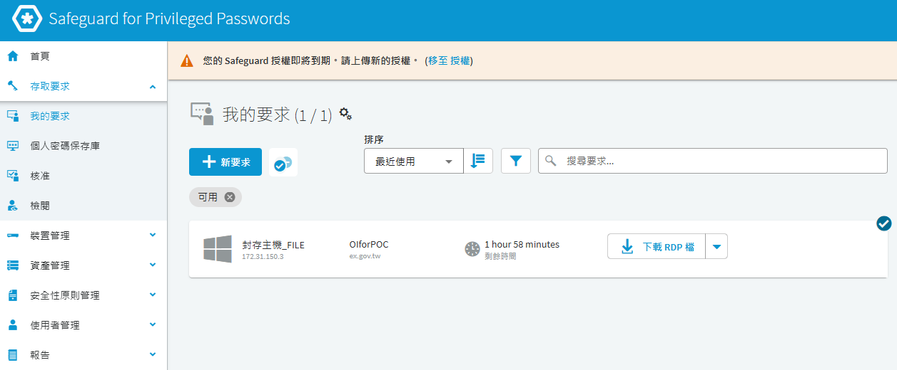
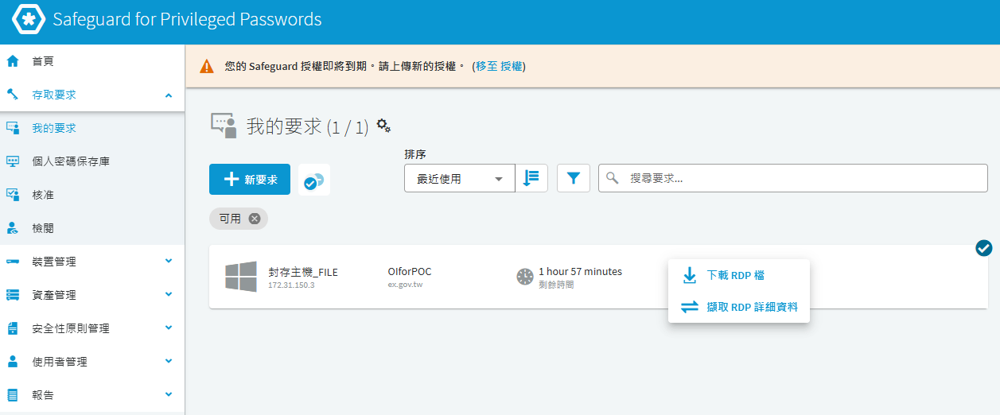
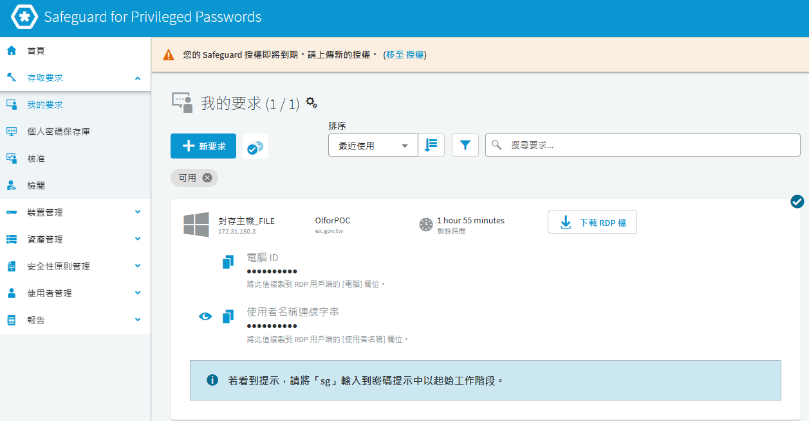
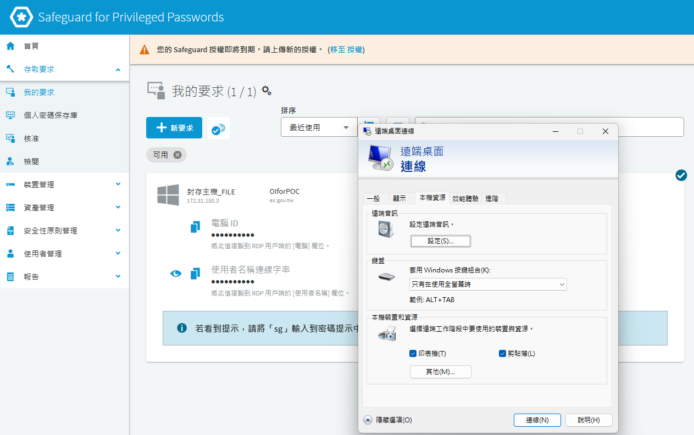
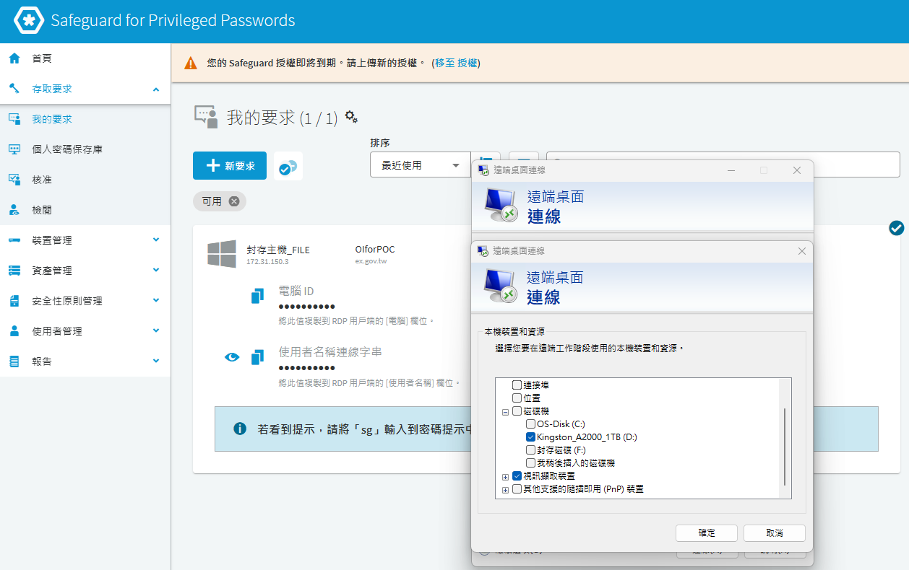
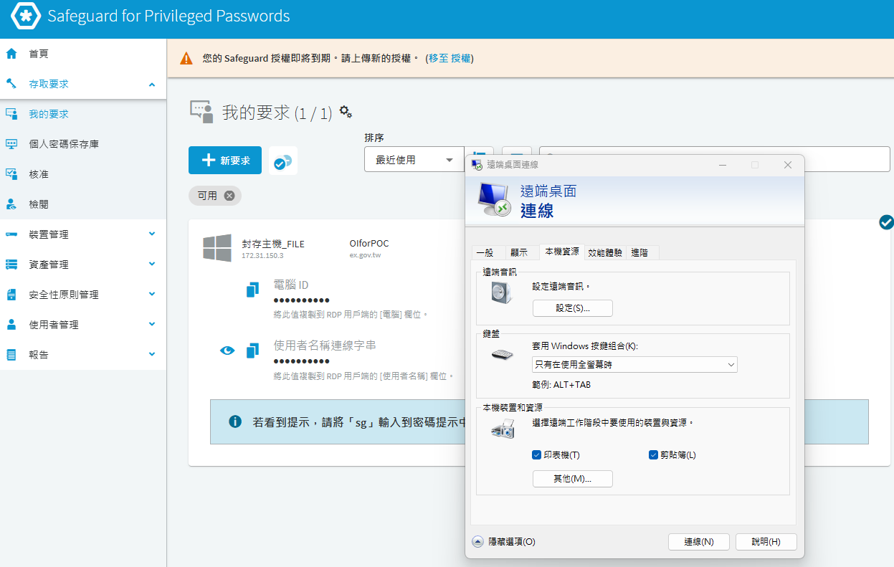
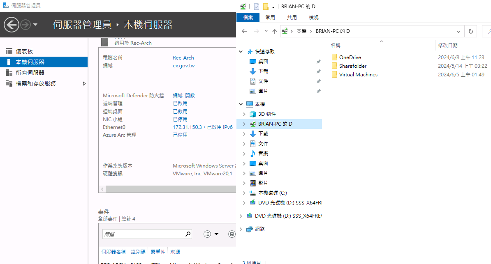

# KB-002：Safeguard RDP 工作階段重新導向本機磁碟

## 用途與適用範圍

來源：使用者提供的《Safeguard遠端桌面掛載磁碟說明.docx》，於 2026-09-30 納入。本文整理 Windows 傳統「遠端桌面連線」用戶端的原文件流程；來源未記載 SPP／SPS 版本，不保證各版本的按鈕名稱完全相同。

這是將用戶端磁碟重新導向至遠端工作階段，不是在 SPS 新增儲存磁碟。原文件資產名稱含 FILE 是原環境慣例，不是產品自動授權規則。磁碟是否可用，須由用戶端、SPS 通道原則與目標主機政策共同允許。

## 前置條件

向管理者確認可進行檔案傳輸的申請範圍並完成核准。只分享工作需要的磁碟，不預設開放全部磁碟；目標端可能讀取或寫入該磁碟，仍受檔案權限及環境政策限制。

## 操作程序

### 取得本次申請的連線資訊

登入 `https://<CUSTOMER_SPP_FQDN>`，申請經管理者核准可使用磁碟重新導向的資產與帳戶。下圖的 FILE 名稱、主機及帳戶均為原環境示例，圖中的授權警告不代表正式環境已通過授權檢查。

在「下載 RDP 檔」右側展開選單，選取原介面中的「擷取 RDP 詳細資料」。

取得本次申請的「電腦 ID」與「使用者名稱連線字串」。這些值用於此次連線，不能從其他人的文件或舊截圖複製。

開啟 Windows「遠端桌面連線」，將電腦 ID 貼入「電腦」，將使用者名稱連線字串貼入「使用者名稱」。原文件此步驟的圖片顯示完整字串，因此未納入 Git；不自行縮短或重組字串，也不要將它當成一般網域帳號。

### 選取允許重新導向的磁碟

切換到「本機資源」，在「本機裝置和資源」按「其他」。

展開磁碟機清單，只勾選核准使用的磁碟後按「確定」。圖中磁碟名稱及勾選是來源文件的示範，不是本專案要求。

按「連線」，依本次 SPP 申請提供的提示完成登入。不要直接改填目標主機位址來繞過 SPS。

### 驗證結果

進入遠端工作階段的檔案總管，確認預定磁碟出現。以無敏感資訊的測試檔驗證核准方向的讀寫，確認未分享額外磁碟；結束時登出並歸還 SPP 申請。

此圖是原文件中的歷史結果，不是本次環境重新測試的紀錄；保留了舊環境的主機、網域與路徑資訊，對外提供前須去識別。

## 無法看到磁碟時

先重新檢查本次連線的磁碟勾選並建立新工作階段。若仍未出現，請管理者核對實際 SPS Connection 所使用的 Channel Policy 是否允許磁碟重新導向，以及目標 Windows 的裝置／資源重新導向政策。不要僅靠資產名稱判定，也不要為排錯直接放寬全部原則。

## 官方依據與來源界線

Microsoft 說明 RDP 可在本機與遠端工作階段間重新導向磁碟，實際結果受設定與政策影響。下列 Microsoft 文件涵蓋多種遠端桌面服務；本文不套用其 Azure Virtual Desktop 主機集區設定。SPS 8.0 官方稽核說明列出 `rdpdr-disk`（Disk redirect），僅作通道辨識參考，不代表來源文件版本已確認。

- [Microsoft：磁碟重新導向與驗證](https://learn.microsoft.com/en-us/azure/virtual-desktop/redirection-configure-drives-storage)
- [One Identity：SPS 8.0 通道稽核資訊](https://support.oneidentity.com/technical-documents/one-identity-safeguard-for-privileged-sessions/8.0%20lts/administration-guide/91)
- [SPP 工作階段申請與歸還](../sop/spp-session-workflow.md)
- [KB 目錄與原始檔保存說明](README.md)
