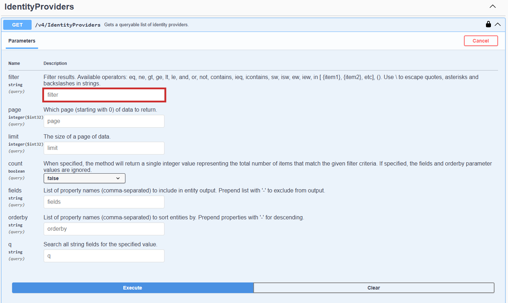
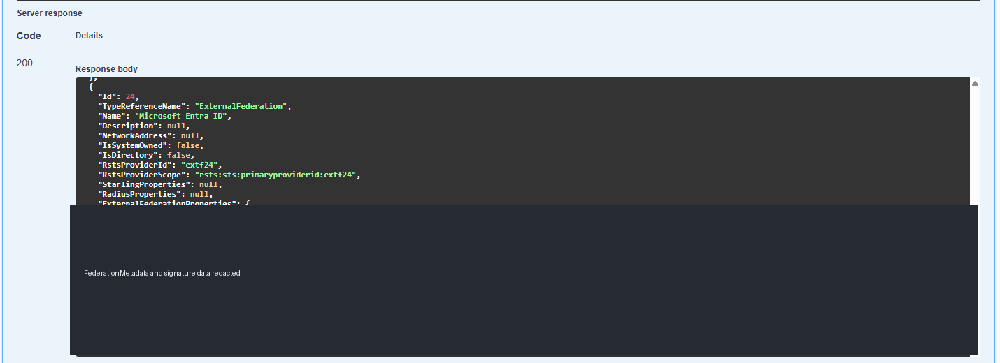
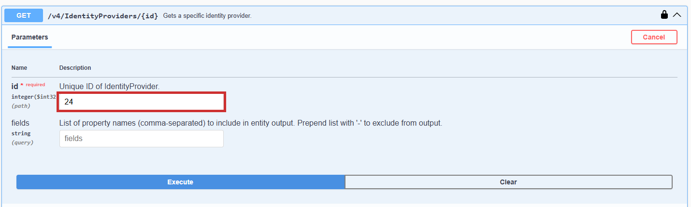
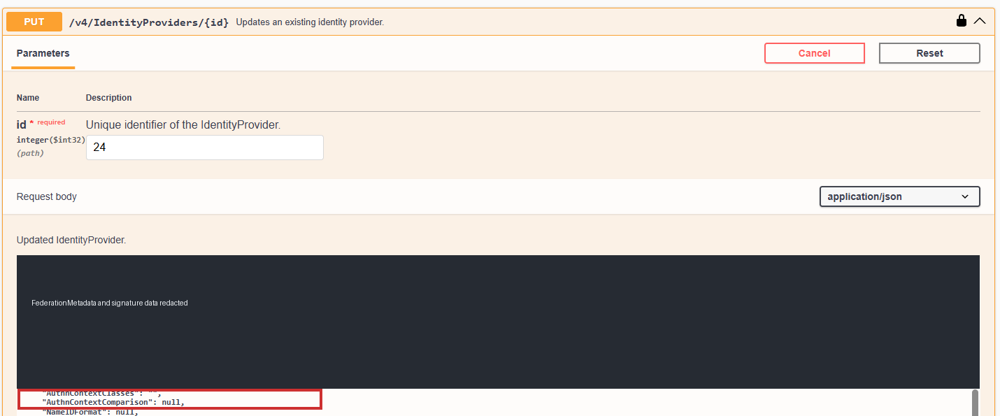
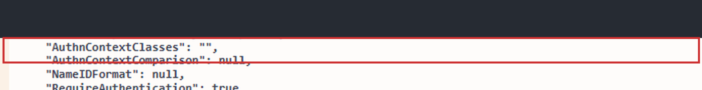
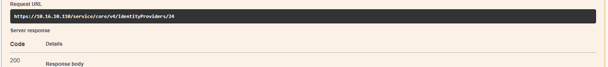

# KB-001：SPP 外部 Federation 登入出現 AADSTS75011

## 問題與適用範圍

來源：使用者提供的《SPP外部Federation修正操作指引.docx》，於 2026-09-30 納入。本文針對 Microsoft Entra ID 外部 Federation 搭配 Passwordless Phone Sign-in 時出現 AADSTS75011 的原文件情境，不代表所有同代碼錯誤均可套用。

原文件引用 One Identity KB 4329266，記載自 SPP 6.11 提供修正、官方範例使用 API v3；其截圖則為 SPP 9.0 Swagger v4。本文保留 v4 的原文件實例，不將其說成原廠已明文核准的通用 v4 程序。本次官方 KB 回傳 HTTP 403，未能重新核對全文，也沒有對設備執行修改。

## 操作前確認

確認錯誤與上述情境一致，備妥可用的替代管理登入方式。以具有管理 IdP 權限的帳戶操作，將完整原始 JSON 存在受控位置。不要將 metadata、簽章、Authorization 或 Bearer token 放入 Git、工單或截圖。

原圖 Id `24` 與名稱 `Microsoft Entra ID` 只是該環境的值；操作時使用查詢得到的 `<CUSTOMER_IDP_ID>`，不可直接套用 24。

## 操作程序

### 查詢目標 IdP

開啟 `https://<CUSTOMER_SPP_FQDN>/service/core/swagger/index.html`，完成授權並確認 v4 定義存在。展開 IdentityProviders，確認 GET 清單、GET by ID 與 PUT 的端點及物件定義。

在 GET `/v4/IdentityProviders` 的 filter 輸入 `Name eq '<CUSTOMER_IDP_NAME>'`。原文件名稱為 Microsoft Entra ID，圖中的紅框只標示欄位位置。

確認結果唯一，且 TypeReferenceName 為 ExternalFederation；若沒有結果或有多筆，先修正條件。

### 備份完整物件

使用 GET `/v4/IdentityProviders/{id}` 查詢目標，保存回應的完整單筆 JSON。不要複製 curl 指令或 Authorization 標頭。GET by ID 回傳物件，不必自行移除陣列框。

### 準備並提交修正

在 PUT `/v4/IdentityProviders/{id}` 使用相同 Id，request body 放入剛保存的完整物件，只把 `ExternalFederationProperties.AuthnContextClasses` 改為空字串 `""`，其餘欄位原樣保留。不得刪除屬性或改成 null；不以只有該欄位的 JSON 片段執行整筆 PUT。若物件包含 Id，確認與路徑相符。

核對目標與完整 request body 後才提交，記錄實際回應碼與錯誤內容。再執行 GET by ID，確認該欄位為空字串且其餘設定未意外改變。

此圖證明的是 GET 回應 HTTP 200，不是 PUT 成功紀錄，也不是使用者登入成功證據。

## 驗證與回復

使用受影響的測試帳戶重新走外部 Federation 登入，確認 Passwordless Phone Sign-in 完成且不再出現 AADSTS75011，保留時間、版本及結果。本文沒有提供該登入驗收截圖。

若修正造成異常，以備份的完整原物件透過相同 Id 的 PUT 還原，再 GET 確认內容及測試登入；不要只回寫單一欄位片段。

## 來源與相關文件

- [原文件引用：One Identity KB 4329266](https://support.oneidentity.com/one-identity-safeguard-for-privileged-passwords/kb/4329266/external-federation-authentication-to-spp-fails-with-error-aadsts75011)，本次無法重新讀取全文。
- [Entra ID 整合 SOP](../sop/spp-entra-id.md)
- [KB 目錄與原始檔保存說明](README.md)
