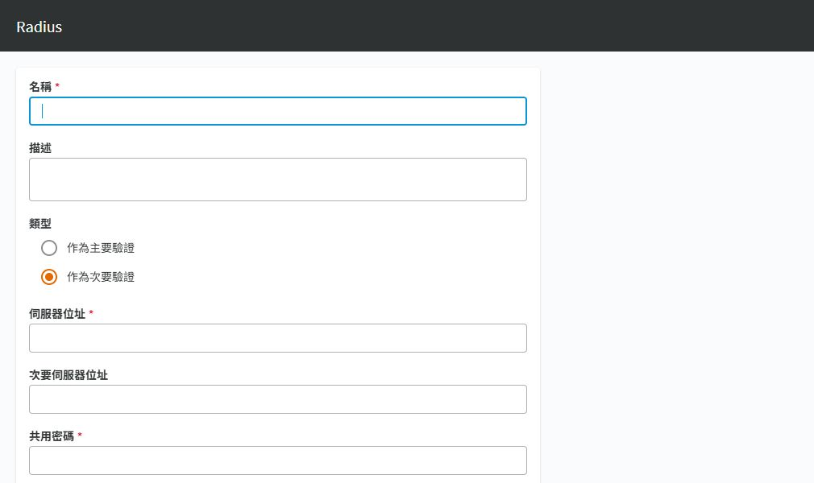

# SPP 與 One Identity Defender 驗證整合

## 目的

以 Defender 提供 SPP 登入的第二因素驗證，將平台登入與後續目標主機存取分開控管。

## 適用範圍

畫面與中文操作名稱於 2026-09-30 以 SPP 9.0.0.2807 Web 用戶端核對；文末 8.0 LTS 官方文件作為原理參考，不代表所有 9.0 行為均已驗證。 Defender 版本未提供，本文只補上 SPP 端 RADIUS 表單，不包含 Defender 安裝或 Schema 變更。

## 前置條件

Defender 管理者已驗證測試使用者的 Token，並提供 RADIUS 位址、實際連接埠、共用密碼、使用者名稱格式與逾時需求。保留本機緊急管理帳戶，且不可把所有管理員一次切換至新驗證方式。

## 操作步驟

> RADIUS 連接埠與逾時等未入鏡欄位不由本圖證明；需展開完整表單核對實際設定。本次未完成 Defender 往返驗證。

### 次要驗證的實際入口

開啟 `裝置管理 > Safeguard 存取 > 識別與驗證 > ＋ > Radius`，確認類型是「作為次要驗證」。

圖 1：SPP 新增 Radius 表單；沒有填入或改動共用密碼。

「伺服器位址」是 Defender RADIUS 服務；「次要伺服器位址」是備援 RADIUS，與上方「次要驗證」的意義不同。「共用密碼」是 SPP 與 RADIUS 伺服器之間的秘密，不是使用者 Token。向下可見連接埠與逾時，本次空白表單顯示 1812 與 20 秒，應依 Defender 實際值填寫。

現場清單有 Radius 提供者，但僅憑名稱不能證明後端產品或 MFA 已驗證。本次未登入 Defender，也未變更任何使用者的驗證方式。

### 實施與驗收程序（尚未實跑）

1. 確認流向為「使用者 → SPP 主驗證 → Defender RADIUS 第二因素 → SPP 授權」。Defender 端登錄的來源須是實際送出驗證的 SPP 節點位址；有 NAT 時核對轉換後的來源。
2. 由 Defender 管理者限制允許來源及測試群組，核對共用密碼與使用者對應，先證明該測試身分可完成 RADIUS 驗證。
3. 在 SPP `Identity and Authentication` 新增 Radius 提供者，Type 選 `As Secondary Authentication`，填入 Server Address、必要時的 Secondary Server Address、Shared Secret、Port 與 Timeout。
4. 只對一個 SPP 測試使用者指定此第二因素。保留既有管理員登入工作階段，另開瀏覽器測試主驗證與 Token。
5. 分別測試正確 Token、錯誤 Token、逾時及服務中斷，確認失敗時不會繞過第二因素；同時比對 SPP 與 Defender 的驗證紀錄。
6. 確認登入成功後仍受既有 Entitlement 限制，再分批套用，記錄支援窗口與 Token 遺失處理流程。

## 注意事項

官方區分主驗證與次驗證提供者；若兩者都要使用同一 RADIUS 服務，需要各建一個提供者。SPP 預設 RADIUS 連接埠為 1812，但仍須以 Defender 實際監聽設定為準。

本篇不代表 SPS 直接 RDP／SSH 連線也已受 MFA 保護。這類需求須另設 SPS 驗證路徑並封鎖繞過途徑。失敗時由保留的管理員撤回測試使用者的第二因素設定，保留驗證紀錄。

## 相關文件

- [實機截圖與驗證範圍](environment-evidence.md)
- [官方：SPP 8.0 LTS，Radius settings](https://support.oneidentity.com/technical-documents/one-identity-safeguard-for-privileged-passwords/8.0%20lts/administration-guide/49)
- [回專案目錄](../../README.md)
