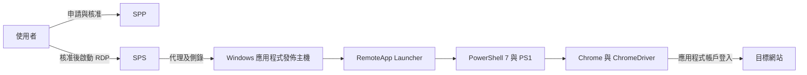
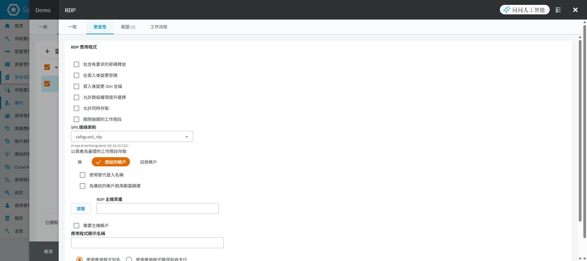
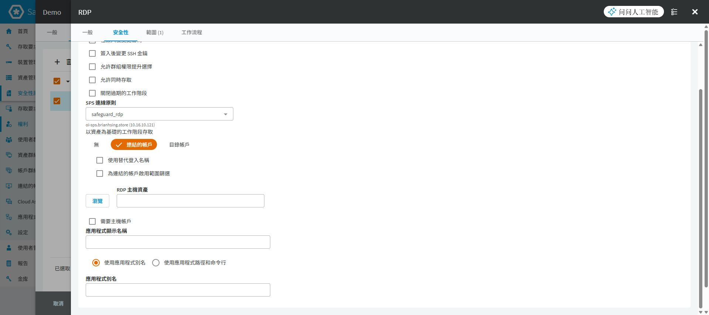
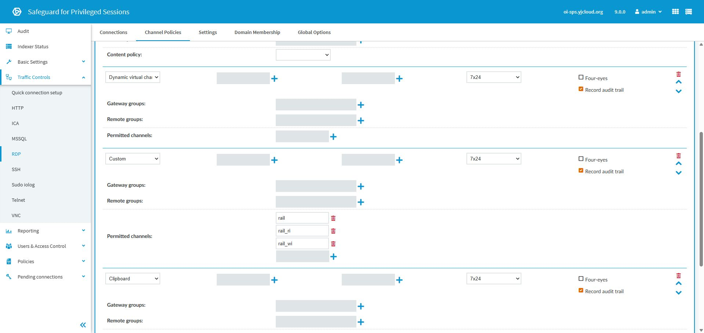

# SPP／SPS 遠端應用程式發佈整合

## 目的

讓使用者經 SPP 申請與核准，由 SPS 代理到 Windows 應用程式發佈主機，再開啟指定工具或執行 PowerShell Selenium 代登。本文以 ApexOne 示範如何串接發佈別名、PS1 與 SPP 原則；其他應用程式依各自腳本與登入流程調整。

## 適用範圍

SPP 畫面為 9.0.0.2807、SPS 為 9.0.0，於 2026-09-30 檢視及補拍。發佈工具與模組目錄圖由使用者提供，屬另一個既有部署案例，不代表與本次實驗室為同一台主機。原理及舊版設定參考文末 8.0 LTS 官方文件，不當作 9.0 全功能相容性證明。

本篇含 11 張操作圖，其中 5 張為這次新拍的 SPP／SPS 畫面。SPP 曾在未儲存表單切換「RDP 應用程式」以顯示欄位，拍完已取消並捨棄；SPS 僅展開既有原則，未按 Commit。沒有完成應用程式代登、RDS 安裝或側錄回放驗收。

## 前置條件

先確認 SPP／SPS 已整合、Windows 發佈主機可由 SPS 連線，且能存取目標應用程式。RDS CAL、授權伺服器及應用程式授權須按實際部署確認；Windows Server 管理用遠端連線不能替代 RDS 發佈所需授權。[Microsoft RDS CAL 說明](https://learn.microsoft.com/en-us/windows-server/remote/remote-desktop-services/rds-client-access-license)。

| 要確認的物件 | 範例或記錄內容 | 與其他物件的關係 |
|---|---|---|
| 發佈主機 | `<CUSTOMER_RDS_HOST>` | 執行 Launcher、PowerShell、Chrome 與 PS1 的 Windows 主機 |
| 主機登入帳戶 | `<CUSTOMER_RDS_ACCOUNT>` | 登入 Windows 工作階段；不同於目標網站帳戶 |
| 目標應用程式 | `<CUSTOMER_APP_HOST>` | ApexOne 等管理網站，供 PS1 的 asset 參數使用 |
| 應用程式帳戶 | `<CUSTOMER_APP_ACCOUNT>` | 輸入目標網站的帳戶，須納入 SPP 的申請範圍 |
| 發佈別名 | `\|\|ApexOne` | SPP 必須指向發佈主機上實際存在的別名 |
| 腳本 | `C:\custom\ApexOne\ApexOne.ps1` | 此路徑存在於發佈主機，不是使用者電腦或 SPS |
| SPS Connection／Channel Policy | 各自記錄名稱 | Connection 必須引用允許 RemoteApp 的 Channel Policy |

上表別名中的兩個直線字元是原始別名語法，並非檔案路徑。實際帳密不得填進文件、Git 或命令列截圖。

## 操作步驟

### 1. 先分清楚三段連線



SPP 管申請與認證，SPS 代理工作階段，PS1 在 Windows 發佈主機內操作應用程式。網站代登失敗不一定是 SPS 問題；應依「RDP 是否建立、程式是否啟動、網站是否登入」逐段判斷。

### 2. 準備發佈主機與 Selenium 元件

先依目標版本完成 RemoteApp Launcher 安裝與 RDS 發佈配置。8.0 LTS 官方整合使用 OISGRemoteAppLauncher，再由其命令列指定實際工具；Publisher 畫面列出的業務名稱不能代替檢查其背後 Launcher 設定。[官方 Remote Desktop Application 整合](https://support.oneidentity.com/technical-documents/one-identity-safeguard-for-privileged-passwords/8.0%20lts/administration-guide/18)。目前沒有 Launcher 安裝精靈與 RDS 發佈精靈的實機圖，這兩段仍需現場確認。

取得 [已保存元件](../../examples/custom-app-login/README.md)，大型套件以 Git LFS 下載。來源是 PowerShell 7.4.6 x64 與 PowerShell Selenium 4.0.0-preview3；它們是歷史案例版本，正式部署另依支援及安全維護要求選版。使用者以 Chrome Dev 搭配相容 ChromeDriver，瀏覽器安裝檔未包含在此目錄。


圖 1：原環境將 selenium 放在 `C:\Program Files\PowerShell\7\Modules`。須用實際 RemoteApp 執行帳戶確認模組可讀取，不能只在管理員自己的使用者模組目錄安裝。


圖 2：driver 位於該模組的 assemblies。版本相容是必要條件；還須確認真正啟動的是哪個 Chrome 執行檔。[Google 官方版本配對說明](https://developer.chrome.com/docs/chromedriver/downloads/version-selection)。來源 ZIP 的 driver 與附帶 sha256 不一致，詳見 [KB-003 的套件核對](../kb/custom-app-login-selenium.md)，不能直接以舊雜湊驗收。

將 ApexOne.ps1 放到前置表格指定路徑。先以專用測試帳戶驗證模組、網路及目標登入頁；確認可開啟頁面與找到欄位，再進行完整代登。此階段不把正式密碼寫進 PS1 或測試紀錄。

### 3. 在 Publisher 建立並核對發佈項目


圖 3：使用者提供的 Remote Application Publisher 1.0.3.48455 畫面。ApexOne 的 Program Path 是 `||ApexOne`，Command Line 呼叫 pwsh.exe。右側部分 Fortigate 命令列已被裁切，不據此猜測完整內容。

選取對應項目後核對 Name、Full Name、Program Path 及 Command Line。以下是圖中 ApexOne 的呼叫方式，用於 Launcher／Publisher 設定，不是直接在 PowerShell 視窗執行的指令：

```text
--cmd "C:\Program Files\PowerShell\7\pwsh.exe" --args "-File C:\custom\ApexOne\ApexOne.ps1 -username {username} -password {password} -asset {asset}"
```

| 參數 | 傳入 PS1 的用途 | 核對重點 |
|---|---|---|
| `--cmd` | Launcher 要啟動的 PowerShell | 路徑存在、執行帳戶有權啟動 |
| `-File` | 要執行的 PS1 | 檔案存在，符合該應用程式版本 |
| `-username`／`-password` | 目標應用程式帳密 | 不是 Windows 發佈主機登入帳密；特殊字元需測試 |
| `-asset` | 目標位址 | ApexOne 腳本自行補 https://，避免重複 scheme |

來源 `pwsh.txt` 另使用 `{Target.AssetNetworkAddress}`。兩種替代欄位不能任意互換；須依當版 Launcher／SPP 設定確認實際帶入值。尤其不要同時把目標 Network Address 設為 None，卻又期待該欄位提供網站位址。實際資產建模與欄位映射尚缺已完成案例畫面，須以測試結果決定。

### 4. 在 SPP 區分發佈主機與應用程式資產

Windows Server 資產用來連線至發佈主機；應用程式資產及帳戶用來表示真正要代登的系統。8.0 LTS 官方範例採 Other／Other Managed 應用程式資產，Network Address 與 Authentication Type 設為 None，並加入應用程式帳戶。這是該官方範例的資料模型，不直接套用到需要目標網路位址的客製化 Selenium 腳本。

依實際整合方式完成兩種資產後，記錄「RDP 主機資產、主機登入帳戶、目標應用程式資產、目標帳戶、asset 來源」五個對應值。不得把主機的 Administrator 誤當作網站帳戶，也不要為了顯示所有帳戶而放寬申請範圍。資產與帳戶操作參考 [新增資產](../../spp_asset.md)及[新增帳戶](spp-account-management.md)。

### 5. 建立專用 RDP 應用程式原則

到 `安全性原則管理 > 權利 > 存取要求原則` 建立專用原則。在「一般」選「工作階段」，再選「RDP 應用程式」。名稱建議能辨識工具，例如 ApexOne-RemoteApp；不要直接改動共用一般 RDP 原則。


圖 4：新拍的未儲存表單，已選到 RDP 應用程式；名稱仍是既有 RDP，僅用於顯示選項。拍完已捨棄，沒有建立 ApexOne 原則。

切到「安全性」，核對 SPS 連線原則，再選擇承載程式的 RDP 主機資產。主機認證需求須依環境設定，不把圖中空白或未勾選視為建議值。



圖 5：可見 SPS 連線原則、RDP 主機資產與「需要主機帳戶」。圖中 safeguard_rdp 是原表單帶入的值；主機仍空白，不是完成設定。

往下設定顯示名稱，選擇「使用應用程式別名」或「使用應用程式路徑和命令行」。以已發佈的 ApexOne 別名流程為例，別名須與發佈主機一致，包含 `||` 前綴。兩種模式擇一，不把別名填到檔案路徑欄位。[官方別名與命令列欄位說明](https://support.oneidentity.com/it-it/technical-documents/one-identity-safeguard/8.0%20lts/administration-guide/101)。



圖 6：新拍的別名模式表單；別名尚未填入。只有圖 3 能證明來源案例存在 ApexOne 發佈項目，不能將兩張圖拼成同一環境已整合成功的證據。

「範圍」只加入本次應用程式所需資產及帳戶；權利的「使用者」加入申請人。「工作流程 > 核准者」指定核准人、人數、期限與通知，核准人不等同申請人。


圖 7：既有一般 RDP 原則的核准欄位定位，畫面為需要 1 人、sgadmin；不是新增 RemoteApp 原則的完成紀錄。另核對緊急存取是否符合制度，避免例外路徑跳過一般核准。

### 6. 在 SPS 核對通道原則

到 `Traffic Controls > RDP > Channel Policies`。正式導入以專用原則配置，避免修改共用原則影響既有連線。以下新圖檢視的是現場 safeguard_default，不代表應將所有正式連線共用它。


圖 8：原則名稱 safeguard_default 可見，Drawing 的 Record audit trail 已勾選。這只證明配置，尚未證明有可播放的 RemoteApp 側錄。



圖 9：同一原則下方可見 Dynamic virtual channel，以及 Custom 的三筆 Permitted channels：rail、rail_ri、rail_wi。原則名稱因捲動不在此圖，與圖 8 配對閱讀。下方 Clipboard 是現場既有值，不是本篇要求必須開放。

依當版整合需求核對 Drawing、Dynamic virtual channel 與 Custom 通道。8.0 LTS SPP 整合說明中的 Dynamic virtual channel 不另填設定，Custom 加入上述三筆。不要把它們填進錯誤的通道類型，也不要為了讓程式啟動而改成全部允許。

### 7. 將 Channel Policy 指派到實際 Connection

回到 `Traffic Controls > RDP > Connections`，展開 SPP 所選的 Connection。核對 Channel policy 指向前一步的原則；有建立原則但沒有指派，不會改變實際連線行為。正式變更前保存原設定，再按核准的變更程序套用。


圖 10：既有 Connection 的局部畫面，Channel policy 為 safeguard_default。此圖不含 Connection 名稱；不能靠此局部圖判定 SPP 一定使用它。圖中備份與封存欄位空白，也不代表保存流程已完成。

### 8. 申請、啟動與驗收


圖 11：首頁「我的要求」、「新要求」與「核准」入口，沿用管理員首頁定位圖；不是測試使用者已申請成功的證據。

使用專用申請人提出該應用程式要求，由另一個核准身分處理，要求可用後啟動。直接啟動涉及本機協定處理程式時，先完成 [SCALUS 配置](scalus-install.md)；不要把使用者電腦上的 SCALUS 與發佈主機上的 Launcher 混為一談。

| 驗收階段 | 必須看見的結果 | 應保存的證據 |
|---|---|---|
| 申請／核准 | 正確工具與目標、取得申請編號；一般流程核准前不可啟動 | 不含密碼的申請與核准狀態 |
| Windows 工作階段 | 連到正確發佈主機、正確主機登入身分 | 主機端工作階段對應紀錄 |
| 啟動工具 | 開啟核准程式，非任意桌面或命令殼層 | 發佈別名與程式啟動畫面 |
| 網站代登 | 正確 URL、目標登入身分，非停留於登入頁 | 去識別後的登入完成畫面 |
| 側錄 | 可依時間／使用者／目標對應並回放 | SPS 查詢與播放結果 |
| 結束 | 目標登出、SPP 歸還、程序清理符合設計 | 歸還狀態及殘留程序檢查 |
| 多人使用 | 兩個工作階段互不干擾 | 不同身分的測試結果 |

目前缺少 Launcher／RDS 安裝及發佈精靈、已填妥的專用 RemoteApp 原則，以及上表的端到端成功截圖；不能用前述設定圖代替。現場補證據時，避免截入密碼、Token、完整一次性連線字串與客戶個資。

## 注意事項

RemoteApp 本身不等於完整程式隔離。須檢查開啟檔案、另存新檔及外部工具是否能跳出核准程式範圍，並限制發佈主機可執行程式及可連目的地。

原始 Selenium PS1 多數使用全域 `taskkill /f /im chromedriver.exe`，且可能略過 TLS 驗證；這些是來源腳本限制，不宜原樣視為多人共用主機的正式範本。詳細差異、asset 格式與 PVE／MSSQL 例外見 [KB-003](../kb/custom-app-login-selenium.md)。

發生問題時依階段縮小範圍：沒有 RDP 工作階段先查申請、主機認證與 SPS Connection；有工作階段但程式未開啟查 Launcher／別名／路徑；瀏覽器已開啟但未登入查實際瀏覽器及 driver、PS1 選取器與目標驗證。回復時先撤回測試權利，再還原原 Connection／Channel Policy 對應；不任意中止既有正式工作階段。

## 相關文件

- [客製化 Selenium 代登、元件與原始腳本](../kb/custom-app-login-selenium.md)
- [實機截圖與驗證範圍](environment-evidence.md)
- [權利與存取原則](spp-entitlements.md)
- [申請、核准與歸還](spp-session-workflow.md)
- [SPP 8.0 LTS 官方 Remote Desktop Application 整合](https://support.oneidentity.com/technical-documents/one-identity-safeguard-for-privileged-passwords/8.0%20lts/administration-guide/18)
- [回專案目錄](../../README.md)
