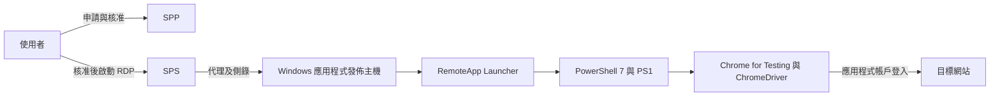
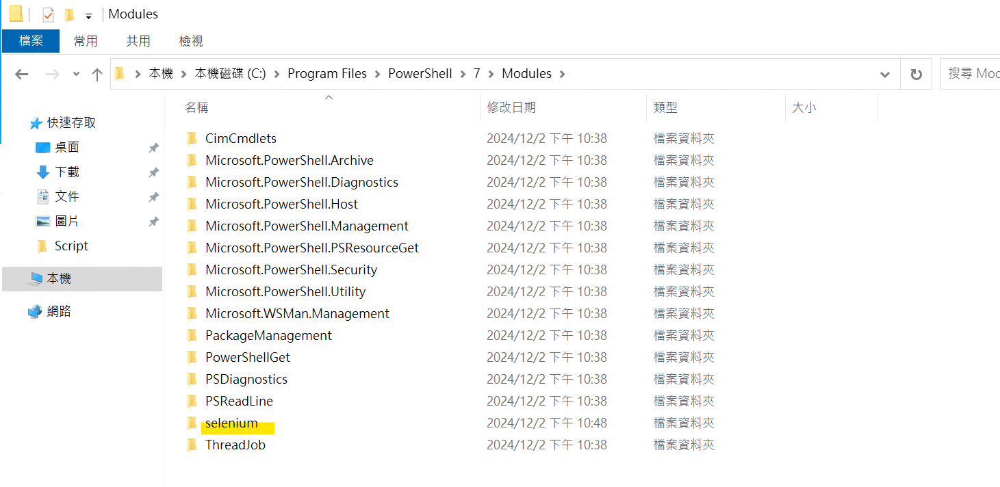
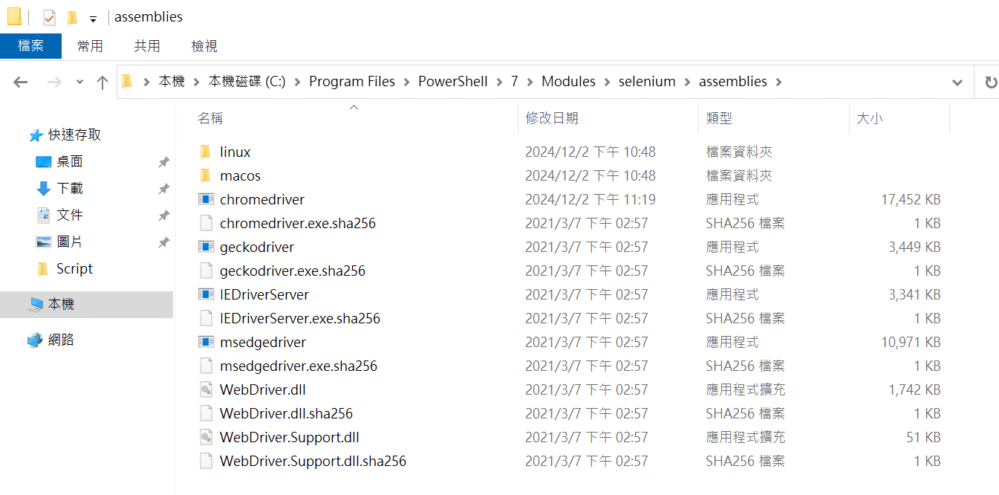
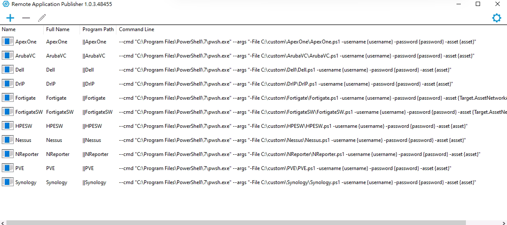
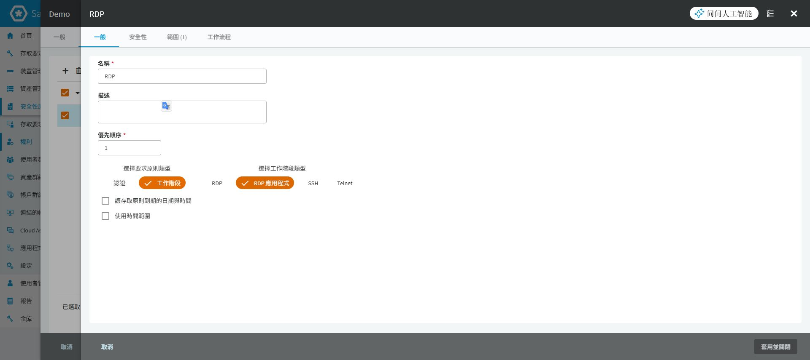
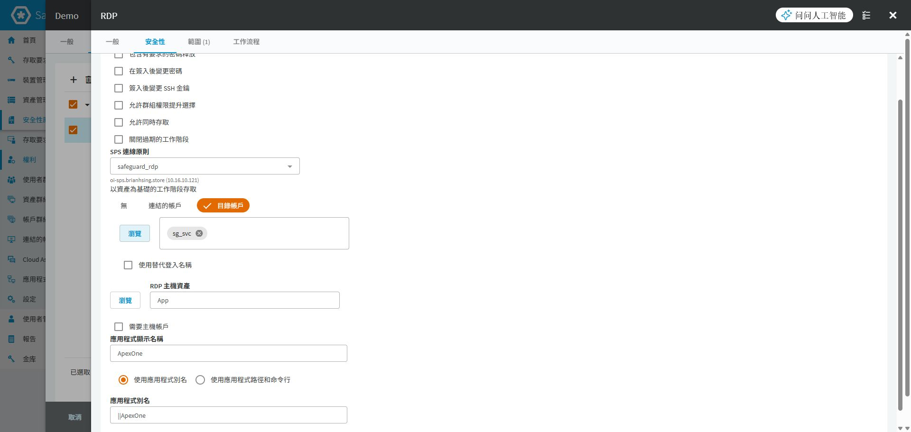
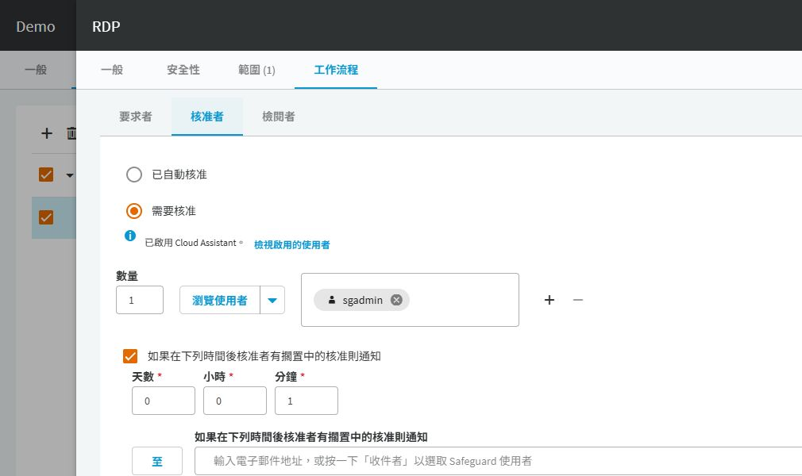
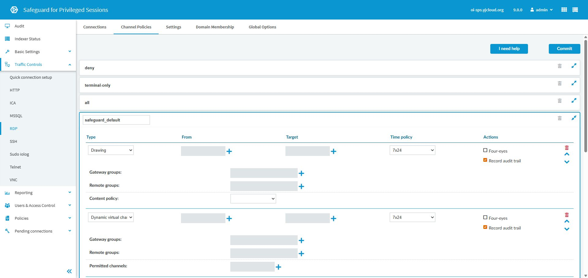
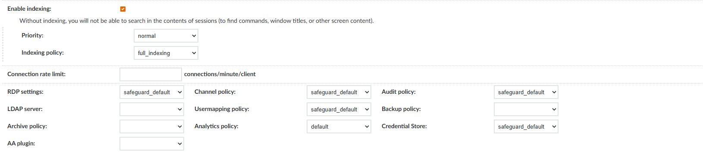
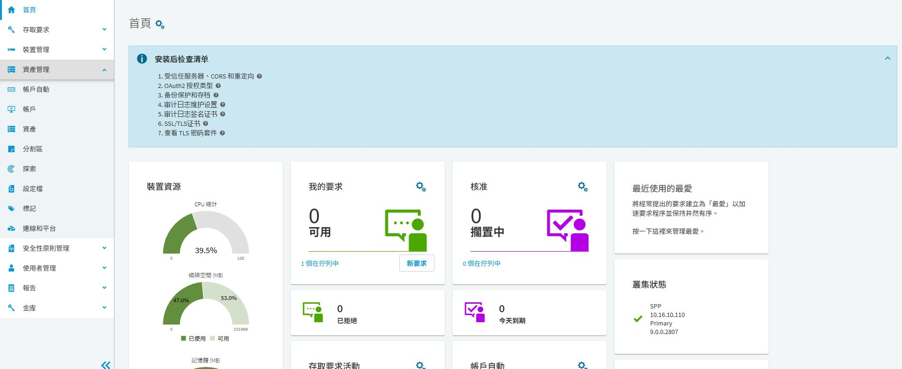

# SPP／SPS 遠端應用程式發佈整合

## 目的

讓使用者經 SPP 申請與核准，由 SPS 代理到 Windows 應用程式發佈主機，再開啟指定工具或執行 PowerShell Selenium 代登。瀏覽器自動化統一使用 **Chrome for Testing（CfT）**，搭配同一發布版本的 ChromeDriver，並以 PowerShell 7 執行。本文以 ApexOne 示範如何串接發佈別名、PS1 與 SPP 原則；其他應用程式依各自腳本與登入流程調整。

## 適用範圍

SPP 畫面為 9.0.0.2807、SPS 為 9.0.0，於 2026-09-30 檢視及補拍。發佈工具與模組目錄圖由使用者提供，屬另一個既有部署案例，不代表與本次實驗室為同一台主機。原理及舊版設定參考文末 8.0 LTS 官方文件，不當作 9.0 全功能相容性證明。

本篇含 11 張操作圖，其中 5 張為這次新拍的 SPP／SPS 畫面。SPP 圖 4–6 已在實機表單填入 ApexOne-RemoteApp、目錄帳戶 sg_svc、RDP 主機 App、顯示名稱 ApexOne 與別名 ||ApexOne 後重新拍攝，拍完已取消並捨棄；SPS 僅展開既有原則，未按 Commit。該次拍攝沒有完成應用程式代登、RDS 安裝或側錄回放驗收。

2026-10-08 補入 2026-10-07 的 Chrome for Testing 排錯紀錄：互動測試成功，但 RemoteApp 使用另一個 Windows 帳號而找不到 Chrome，改用 Machine PATH 後使用者回報成功。此案例與前述實驗室截圖分開記錄，不代表已補齊 SPS 側錄回放、多人使用或全部應用程式的驗收。新增案例以 `<CUSTOMER_TEST_USER>` 與 `<CUSTOMER_REMOTEAPP_USER>` 代稱，不保留客戶位址或帳密。

## 前置條件

先確認 SPP／SPS 已整合、Windows 發佈主機可由 SPS 連線，且能存取目標應用程式。RDS CAL、授權伺服器及應用程式授權須按實際部署確認；Windows Server 管理用遠端連線不能替代 RDS 發佈所需授權。[Microsoft RDS CAL 說明](https://learn.microsoft.com/en-us/windows-server/remote/remote-desktop-services/rds-client-access-license)。

| 要確認的物件 | 範例或記錄內容 | 與其他物件的關係 |
|---|---|---|
| 發佈主機 | `<CUSTOMER_RDS_HOST>` | 執行 Launcher、PowerShell、Chrome for Testing 與 PS1 的 Windows 主機 |
| 主機登入帳戶 | `<CUSTOMER_RDS_ACCOUNT>` | 登入 Windows 工作階段；不同於目標網站帳戶 |
| 目標應用程式 | `<CUSTOMER_APP_HOST>` | ApexOne 等管理網站，供 PS1 的 asset 參數使用 |
| 應用程式帳戶 | `<CUSTOMER_APP_ACCOUNT>` | 輸入目標網站的帳戶，須納入 SPP 的申請範圍 |
| 發佈別名 | `\|\|ApexOne` | SPP 必須指向發佈主機上實際存在的別名 |
| 腳本 | `C:\custom\ApexOne\ApexOne.ps1` | 此路徑存在於發佈主機，不是使用者電腦或 SPS |
| SPS Connection／Channel Policy | 各自記錄名稱 | Connection 必須引用允許 RemoteApp 的 Channel Policy |

上表別名中的兩個直線字元是原始別名語法，並非檔案路徑。實際帳密不得填進文件、Git 或命令列截圖。

## 操作步驟

### 1. 先分清楚三段連線



SPP 管申請與認證，SPS 代理工作階段，PS1 在 Windows 發佈主機內操作應用程式。網站代登失敗不一定是 SPS 問題；應依「RDP 是否建立、程式是否啟動、網站是否登入」逐段判斷。

### 2. 準備發佈主機與 Selenium 元件

先依目標版本完成 RemoteApp Launcher 安裝與 RDS 發佈配置。8.0 LTS 官方整合使用 OISGRemoteAppLauncher，再由其命令列指定實際工具；Publisher 畫面列出的業務名稱不能代替檢查其背後 Launcher 設定。[官方 Remote Desktop Application 整合](https://support.oneidentity.com/technical-documents/one-identity-safeguard-for-privileged-passwords/8.0%20lts/administration-guide/18)。目前沒有 Launcher 安裝精靈與 RDS 發佈精靈的實機圖，這兩段仍需現場確認。

取得 [已保存元件](../../examples/custom-app-login/README.md)，大型套件以 Git LFS 下載。來源是 PowerShell 7.4.6 x64 與 PowerShell Selenium 4.0.0-preview3；它們是歷史案例版本，正式部署另依支援及安全維護要求選版。**現行自動化標準為 Chrome for Testing，不使用 Chrome Dev 或一般 Chrome 作為固定版本的自動化瀏覽器。** 瀏覽器套件未包含在此目錄，需另由 Google 官方取得；相關 KB 的 Chrome Dev 描述屬舊案例背景，以本節為現行部署基準。



圖 1：原環境將 selenium 放在 `C:\Program Files\PowerShell\7\Modules`。須用實際 RemoteApp 執行帳戶確認模組可讀取，不能只在管理員自己的使用者模組目錄安裝。



圖 2：歷史配置的 driver 位於該模組的 assemblies，不是現行獨立目錄的示範。現行配置以 `-WebDriverPath` 明確指定 `C:\Automation\chromedriver`，避免模組繼續使用內附舊版。版本相容是必要條件；還須確認真正啟動的是哪個 Chrome 執行檔。[Google 官方版本配對說明](https://developer.chrome.com/docs/chromedriver/downloads/version-selection)。來源 ZIP 的 driver 與附帶 sha256 不一致，詳見 [KB-003 的套件核對](../kb/custom-app-login-selenium.md)，不能直接以舊雜湊驗收。

將 ApexOne.ps1 放到前置表格指定路徑。先以專用測試帳戶驗證模組、網路及目標登入頁；確認可開啟頁面與找到欄位，再進行完整代登。此階段不把正式密碼寫進 PS1 或測試紀錄。

#### 2.1 Chrome for Testing 的部署與版本原則

Chrome Dev／一般 Chrome 的更新會讓自動化環境版本改變；把測試檔案放進既有 Chrome 安裝目錄，也會增加安裝與更新維護互相干擾的風險。本案曾遇到更新或覆蓋問題，但沒有完整更新程序證據，不推論所有 Dev 安裝都會被一般版覆蓋。

Google 提供的 CfT 專供測試且不自動更新，適合固定版本的自動化。一般使用者的瀏覽器維持原本更新管理，不以停用全機 Chrome 更新服務解決自動化問題。[Google Chrome for Testing 說明](https://developer.chrome.com/docs/automation-and-testing/chrome-for-testing)。

從 [CfT 官方下載頁](https://googlechromelabs.github.io/chrome-for-testing/)選定核准版本與 Windows 平台，取得 **同一發布版本**的 Chrome 與 ChromeDriver。解壓縮時保留 Chrome 完整相依檔案，不只複製 chrome.exe；完成後核對：

```text
C:\Automation\chrome\chrome.exe
C:\Automation\chromedriver\chromedriver.exe
```

不要放入 `C:\Program Files\Google\Chrome\Application`；獨立目錄是本專案的部署規範，避免與既有 Chrome 共用檔案。程式目錄由管理者維護，RemoteApp 帳號只授予讀取與執行，日誌另放可寫入位置。CfT 不自動更新仍須安排成套升級、回歸測試與回復版本，不能永久停留在舊版。

#### 2.2 PATH 與實際執行身分

PATH 填的是**包含執行檔的資料夾**，不是執行檔本身：

| 設定 | 正確值 | 常見錯誤 |
|---|---|---|
| Chrome PATH | `C:\Automation\chrome` | 填成 `...\chrome.exe`，或多一層不存在的 `...\chrome\chrome` |
| ChromeDriver PATH | `C:\Automation\chromedriver` | 填成 `...\chromedriver.exe` |
| 解壓縮層級 | chrome.exe 直接位於標準目錄 | 實際藏在 chrome-win64 子目錄，PATH 卻指向上層 |

User PATH 僅屬於該 Windows 帳號；Machine PATH 為全機設定。程序取得的是啟動時繼承的環境，修改系統設定不會自動刷新既有 RDS 工作階段。[Microsoft 環境變數範圍與繼承](https://learn.microsoft.com/powershell/module/microsoft.powershell.core/about/about_environment_variables)。

本案 `<CUSTOMER_TEST_USER>` 的互動測試成功，RemoteApp 卻以 `<CUSTOMER_REMOTEAPP_USER>` 執行，無法使用前者的 User PATH，出現 `cannot find Chrome binary`。改用 Machine PATH 並重新取得環境後，使用者回報成功。**測試與驗收都須以實際 RemoteApp 帳號進行，不能只看管理員視窗的結果。**

以下腳本適用 PowerShell 7，存為 `C:\Automation\Set-AutomationPath.ps1`，以系統管理員執行。它保留原 PATH 順序，僅補上缺少的目錄，並記錄異動前後值；Machine PATH 會影響其他帳號的新程序，先 `-WhatIf`，再 `-Confirm` 套用。

```powershell
#requires -Version 7.0
#requires -RunAsAdministrator
[CmdletBinding(SupportsShouldProcess, ConfirmImpact='High')]
param()
$ErrorActionPreference = 'Stop'
$dirs = @('C:\Automation\chrome',
          'C:\Automation\chromedriver')
$files = @('chrome.exe', 'chromedriver.exe')
for ($i = 0; $i -lt $dirs.Count; $i++) {
    if (-not (Test-Path (Join-Path $dirs[$i] $files[$i]))) {
        throw "Missing executable in $($dirs[$i])"
    }
}
$before = [Environment]::GetEnvironmentVariable('Path','Machine')
$parts = @($before -split ';' | Where-Object { $_.Trim() })
$normalized = @($parts | ForEach-Object {
    $_.Trim().TrimEnd('\')
})
$add = @($dirs | Where-Object { $_ -notin $normalized })
if ($add.Count -eq 0) { Write-Output 'No change required'; return }
$after = (@($parts) + @($add)) -join ';'
Write-Output "Before: $before"
Write-Output "After:  $after"
if ($PSCmdlet.ShouldProcess('Machine PATH','Append automation folders')) {
    $audit = Join-Path $PSScriptRoot (
        'PathChange-{0}.csv' -f (Get-Date -Format 'yyyyMMdd-HHmmssfff'))
    $record = [pscustomobject]@{
        Time = (Get-Date).ToString('o'); Before = $before
        Proposed = $after; Actual = $before; Status = 'Prepared'
    }
    $record | Export-Csv $audit -NoTypeInformation -Encoding utf8
    [Environment]::SetEnvironmentVariable('Path',$after,'Machine')
    $record.Actual = [Environment]::GetEnvironmentVariable('Path','Machine')
    $record.Status = 'Applied'
    $record | Export-Csv $audit -NoTypeInformation -Encoding utf8
    Write-Output "Audit: $audit"
}
```

```powershell
& 'C:\Automation\Set-AutomationPath.ps1' -WhatIf
& 'C:\Automation\Set-AutomationPath.ps1' -Confirm
```

確認沒有進行中的工作，再登出並重建實際帳號的 RDS 工作階段。若只重啟子程序，其父程序仍可能帶著舊 PATH。若需回復，依 CSV 的 Before 值比對現況後還原本次新增項目，避免覆蓋後續合法變更。

#### 2.3 PowerShell 7 與模組相容性

腳本開頭加上 `#requires -Version 7.0`，Launcher 明確使用 `pwsh.exe`。Windows PowerShell 5.1／ISE 使用 .NET Framework，PowerShell 7 使用現代 .NET；ISE 不會因安裝 PowerShell 7 而切換引擎。`#requires` 只限制最低版本，不會自動啟動 PowerShell 7。[Microsoft 移轉說明](https://learn.microsoft.com/powershell/scripting/install/migrating-from-windows-powershell-51-to-powershell-7)、[Requires 說明](https://learn.microsoft.com/powershell/module/microsoft.powershell.core/about/about_requires?view=powershell-7.4)。

本案在 Windows PowerShell 5.1 載入 WebDriver.dll 失敗，在 PowerShell 7 成功；日誌記錄 PowerShell 7.4.17，命令輸出顯示 Selenium 4.0.0。這是本案觀察，不是所有 Selenium 套件均不支援 5.1 的原廠聲明，也不是現行版本建議。模組顯示 4.0.0 不足以辨識 preview 套件標籤，部署時須留存套件來源與雜湊。

```powershell
$PSVersionTable | Select-Object PSVersion, PSEdition
Get-Module Selenium -ListAvailable | Select-Object Name, Version, Path
Import-Module Selenium -RequiredVersion 4.0.0 -ErrorAction Stop
Get-Command Start-SeDriver -Syntax
Get-Command Start-SeDriver | Select-Object Name, Version, Source
```

以下為儲存庫既有 `selenium.zip` 的介面寫法；已核對其中 `Start-SeDriver`、`New-SeDriverService` 與 Chrome 啟動實作：`-BinaryPath` 接受瀏覽器執行檔，`-WebDriverPath` 接受 Driver **資料夾**，未指定後者時會使用模組的 assemblies。現場不同套件須先核對 `Get-Command` 結果，不能把這兩個參數當成所有 Selenium PowerShell 模組的通用介面。[已保存套件](../../examples/custom-app-login/README.md)。

```powershell
#requires -Version 7.0
Import-Module Selenium -RequiredVersion 4.0.0 -ErrorAction Stop
$asset = 'https://<CUSTOMER_APP_HOST>:<CUSTOMER_APP_PORT>/'
Start-SeDriver -Browser Chrome `
    -BinaryPath 'C:\Automation\chrome\chrome.exe' `
    -WebDriverPath 'C:\Automation\chromedriver' `
    -Arguments @('--start-maximized') `
    -StartURL $asset
```

單獨測試時，先在同一工作階段指定 `$asset`，不能假設它已從原 PS1 傳入。這裡的 `-StartURL` 使用完整 URL；原 ApexOne 腳本的 `-asset` 自行補 `https://`，仍要依原腳本介面傳入，避免重複 scheme。

本案排錯曾使用 `@('--start-maximized', '--ignore-certificate-errors')`。前者最大化視窗，後者略過憑證相關錯誤；正式設定預設只保留前者，修正憑證鏈與名稱後驗收。忽略憑證只限受控測試，不作通用正式設定。[Chromium 參數定義](https://chromium.googlesource.com/chromium/src/+/5a60c8bb002e4573dd0809f4a78d56b4c9720add/chrome/common/chrome_switches.cc)。

明確指定路徑可避免同機其他 Chrome 或模組內附 Driver 被誤用；Machine PATH 則提供各帳號一致的命令搜尋環境。`where.exe` 成功只證明搜尋結果，不能代替核對 Selenium 實際使用的執行檔。[Google ChromeOptions 說明](https://developer.chrome.com/docs/chromedriver/capabilities)。

### 3. 在 Publisher 建立並核對發佈項目



圖 3：使用者提供的 Remote Application Publisher 1.0.3.48455 畫面。ApexOne 的 Program Path 是 `||ApexOne`，Command Line 呼叫 pwsh.exe。右側部分 Fortigate 命令列已被裁切，不據此猜測完整內容。

選取對應項目後核對 Name、Full Name、Program Path 及 Command Line。以下是圖中 ApexOne 的呼叫方式，用於 Launcher／Publisher 設定，不是直接在 PowerShell 視窗執行的指令：

```text
--cmd "C:\Program Files\PowerShell\7\pwsh.exe" --args "-File C:\custom\ApexOne\ApexOne.ps1 -username {username} -password {password} -asset {asset}"
```

| 參數 | 傳入 PS1 的用途 | 核對重點 |
|---|---|---|
| `--cmd` | Launcher 要啟動的 PowerShell | 路徑存在、執行帳戶有權啟動 |
| `-File` | 要執行的 PS1 | 檔案存在，符合該應用程式版本 |
| `-username`／`-password` | 目標應用程式帳密 | 不是 Windows 發佈主機登入帳密；特殊字元需測試 |
| `-asset` | 目標位址 | ApexOne 腳本自行補 https://，避免重複 scheme |

來源 `pwsh.txt` 另使用 `{Target.AssetNetworkAddress}`。兩種替代欄位不能任意互換；須依當版 Launcher／SPP 設定確認實際帶入值。尤其不要同時把目標 Network Address 設為 None，卻又期待該欄位提供網站位址。實際資產建模與欄位映射尚缺已完成案例畫面，須以測試結果決定。

#### 3.1 用腳本內日誌定位閃退

不要把 `*> C:\...\debug.log` 直接放入 Launcher 傳給 `pwsh.exe -File` 的參數。`*>` 是 PowerShell 語法；外層若未透過 PowerShell 剖析，不會自動變成重新導向，反而可能被當成腳本參數。[Microsoft pwsh 的 File 參數](https://learn.microsoft.com/powershell/module/microsoft.powershell.core/about/about_pwsh?view=powershell-7.4)。

以下為獨立啟動診斷腳本，可存為 `C:\Automation\Test-BrowserStart.ps1`。它使用實際帳號的 TEMP 目錄，透過 `try/catch` 與 `Out-File` 記錄階段，不接收或記錄密碼。此測試只確認瀏覽器啟動，完整代登仍須由既有 PS1 與 RemoteApp 入口驗收。

```powershell
#requires -Version 7.0
[CmdletBinding()]
param([Parameter(Mandatory)][string]$Asset)
$ErrorActionPreference = 'Stop'
$log = Join-Path ([IO.Path]::GetTempPath()) (
    'BrowserStart-{0}-{1}.log' -f (Get-Date -Format 'yyyyMMdd-HHmmss'),$PID)
function Write-Log([string]$Text) {
    '[{0}] {1}' -f (Get-Date -Format 'yyyy-MM-dd HH:mm:ss'),$Text |
        Out-File -LiteralPath $log -Append -Encoding utf8
}
$stage = 'Validate URL'
try {
    Write-Log 'Script started'
    Write-Log "PowerShell: $($PSVersionTable.PSVersion)"
    $uri = $null
    if (-not [Uri]::TryCreate($Asset,[UriKind]::Absolute,[ref]$uri) -or
        $uri.Scheme -notin @('https','http')) {
        throw 'Invalid URL'
    }
    $stage = 'Import module'
    Import-Module Selenium -RequiredVersion 4.0.0 -ErrorAction Stop
    $stage = 'Start-SeDriver'
    Start-SeDriver -Browser Chrome `
        -BinaryPath 'C:\Automation\chrome\chrome.exe' `
        -WebDriverPath 'C:\Automation\chromedriver' `
        -Arguments @('--start-maximized') `
        -StartURL $Asset | Out-Null
    Write-Log 'Start-SeDriver completed'
}
catch {
    $reason = 'Unclassified failure'
    if ($_.Exception.ToString() -match 'cannot find Chrome binary') {
        $reason = 'cannot find Chrome binary'
    } elseif ($_.Exception.ToString() -match 'only supports Chrome version') {
        $reason = 'ChromeDriver version mismatch'
    }
    Write-Log "ERROR stage=$stage; reason=$reason"
    throw "Browser startup failed at $stage. Review local log: $log"
}
finally {
    Write-Output "Log: $log"
}
```

```powershell
& 'C:\Automation\Test-BrowserStart.ps1' `
    -Asset 'https://<CUSTOMER_APP_HOST>:<CUSTOMER_APP_PORT>/'
```

整合回既有 PS1 時，將日誌初始化放在 `param(...)` 後、模組載入前，保留原本登入與結束處理，加入各階段成功標記。不要落盤 `$password`、完整命令列、Token、Cookie 或完整 `$_ | Format-List *`；錯誤物件可能含參數或頁面資料，範例只輸出白名單錯誤分類。`#requires` 失敗發生在腳本執行前，不會被這個 catch 捕捉，須先確認啟動的是 pwsh.exe。

日誌與 `whoami` 的原始結果留在受控位置；對外分享前去識別，且不要為排錯開啟會收錄密碼的整段 Transcript。多人使用時只清理自己建立的 Driver／瀏覽器，不以全機 `taskkill /f /im` 結束其他人的工作。

### 4. 在 SPP 區分發佈主機與應用程式資產

Windows Server 資產用來連線至發佈主機；應用程式資產及帳戶用來表示真正要代登的系統。8.0 LTS 官方範例採 Other／Other Managed 應用程式資產，Network Address 與 Authentication Type 設為 None，並加入應用程式帳戶。這是該官方範例的資料模型，不直接套用到需要目標網路位址的客製化 Selenium 腳本。

依實際整合方式完成兩種資產後，記錄「RDP 主機資產、主機登入帳戶、目標應用程式資產、目標帳戶、asset 來源」五個對應值。不得把主機的 Administrator 誤當作網站帳戶，也不要為了顯示所有帳戶而放寬申請範圍。資產與帳戶操作參考 [新增資產](../../spp_asset.md)及[新增帳戶](spp-account-management.md)。

### 5. 建立專用 RDP 應用程式原則

到 `安全性原則管理 > 權利 > 存取要求原則` 建立專用原則。在「一般」選「工作階段」，再選「RDP 應用程式」。名稱建議能辨識工具，例如 ApexOne-RemoteApp；不要直接改動共用一般 RDP 原則。



圖 4：實機填入名稱 ApexOne-RemoteApp、描述「ApexOne 網頁代登，使用目錄帳戶」，並選取工作階段／RDP 應用程式。上方 RDP 是原編輯視窗標題，名稱欄位已填入示範值；拍攝後未儲存。

切到「安全性」，依下表填寫。本文採「目錄帳戶」，按其下方「瀏覽」選取已納管的目錄帳戶，不使用「連結的帳戶」。接著按 RDP 主機資產旁的另一個「瀏覽」選主機；兩個瀏覽按鈕用途不同。

| 欄位 | 本次實際填入值 |
|---|---|
| SPS 連線原則 | safeguard_rdp |
| 以資產為基礎的工作階段存取 | 目錄帳戶 |
| 目錄帳戶 | AD-DC2025 的 sg_svc，網域 brian.local |
| RDP 主機資產 | App，資產清單位址 10.16.10.108 |
| 應用程式顯示名稱 | ApexOne |
| 啟動方式 | 使用應用程式別名 |
| 應用程式別名 | `\|\|ApexOne` |

本次先以既有 App 資產作為填寫範例；尚未確認它已安裝 ApexOne 發佈項目。sg_svc 是從既有目錄帳戶清單選取的示範值，不代表已驗證其應用程式權限，正式使用應換成客戶核准的最小權限帳戶。


圖 5：已選取「目錄帳戶」，清單顯示 sg_svc，RDP 主機資產填入 App，應用程式顯示名稱為 ApexOne；圖文使用同一組值。

「目錄帳戶」與「需要主機帳戶」是不同設定。圖中「需要主機帳戶」未勾選；8.0 LTS 官方文件說明此時會在工作階段初始化要求提供主機認證，不能把 sg_svc 自動視為 Windows 主機登入帳戶。若設計要求預先指定主機帳戶，須另外勾選並選取經核准的主機帳戶，再驗證 9.0 實際流程。[官方帳戶與主機欄位說明](https://support.oneidentity.com/it-it/technical-documents/one-identity-safeguard/8.0%20lts/administration-guide/101)。

往下設定顯示名稱，選擇「使用應用程式別名」或「使用應用程式路徑和命令行」。以已發佈的 ApexOne 別名流程為例，別名須與發佈主機一致，包含 `||` 前綴。兩種模式擇一，不把別名填到檔案路徑欄位。[官方別名與命令列欄位說明](https://support.oneidentity.com/it-it/technical-documents/one-identity-safeguard/8.0%20lts/administration-guide/101)。



圖 6：同一實機表單已填入 ApexOne 與 `||ApexOne`，並保留上方目錄帳戶 sg_svc 及主機 App 供對照。圖 3 是使用者提供的發佈案例；本圖是實驗室填寫示範，尚未做兩端連線驗收。

「範圍」只加入本次應用程式所需資產及帳戶；權利的「使用者」加入申請人。「工作流程 > 核准者」指定核准人、人數、期限與通知，核准人不等同申請人。



圖 7：既有一般 RDP 原則的核准欄位定位，畫面為需要 1 人、sgadmin；不是新增 RemoteApp 原則的完成紀錄。另核對緊急存取是否符合制度，避免例外路徑跳過一般核准。

### 6. 在 SPS 核對通道原則

到 `Traffic Controls > RDP > Channel Policies`。正式導入以專用原則配置，避免修改共用原則影響既有連線。以下新圖檢視的是現場 safeguard_default，不代表應將所有正式連線共用它。



圖 8：原則名稱 safeguard_default 可見，Drawing 的 Record audit trail 已勾選。這只證明配置，尚未證明有可播放的 RemoteApp 側錄。


圖 9：同一原則下方可見 Dynamic virtual channel，以及 Custom 的三筆 Permitted channels：rail、rail_ri、rail_wi。原則名稱因捲動不在此圖，與圖 8 配對閱讀。下方 Clipboard 是現場既有值，不是本篇要求必須開放。

依當版整合需求核對 Drawing、Dynamic virtual channel 與 Custom 通道。8.0 LTS SPP 整合說明中的 Dynamic virtual channel 不另填設定，Custom 加入上述三筆。不要把它們填進錯誤的通道類型，也不要為了讓程式啟動而改成全部允許。

### 7. 將 Channel Policy 指派到實際 Connection

回到 `Traffic Controls > RDP > Connections`，展開 SPP 所選的 Connection。核對 Channel policy 指向前一步的原則；有建立原則但沒有指派，不會改變實際連線行為。正式變更前保存原設定，再按核准的變更程序套用。



圖 10：既有 Connection 的局部畫面，Channel policy 為 safeguard_default。此圖不含 Connection 名稱；不能靠此局部圖判定 SPP 一定使用它。圖中備份與封存欄位空白，也不代表保存流程已完成。

### 8. 申請、啟動與驗收



圖 11：首頁「我的要求」、「新要求」與「核准」入口，沿用管理員首頁定位圖；不是測試使用者已申請成功的證據。

使用專用申請人提出該應用程式要求，由另一個核准身分處理，要求可用後啟動。直接啟動涉及本機協定處理程式時，先完成 [SCALUS 配置](scalus-install.md)；不要把使用者電腦上的 SCALUS 與發佈主機上的 Launcher 混為一談。

| 驗收階段 | 必須看見的結果 | 應保存的證據 |
|---|---|---|
| 申請／核准 | 正確工具與目標、取得申請編號；一般流程核准前不可啟動 | 不含密碼的申請與核准狀態 |
| Windows 工作階段 | 連到正確發佈主機、正確主機登入身分 | 主機端工作階段對應紀錄 |
| 啟動工具 | 開啟核准程式，非任意桌面或命令殼層 | 發佈別名與程式啟動畫面 |
| 網站代登 | 正確 URL、目標登入身分，非停留於登入頁 | 去識別後的登入完成畫面 |
| 側錄 | 可依時間／使用者／目標對應並回放 | SPS 查詢與播放結果 |
| 結束 | 目標登出、SPP 歸還、程序清理符合設計 | 歸還狀態及殘留程序檢查 |
| 多人使用 | 兩個工作階段互不干擾 | 不同身分的測試結果 |

目前已補上填妥的 RemoteApp 表單；仍缺 Launcher／RDS 安裝及發佈精靈、原則儲存後的確認，以及上表的端到端成功截圖；不能用前述設定圖代替。現場補證據時，避免截入密碼、Token、完整一次性連線字串與客戶個資。

#### 8.1 瀏覽器自動化驗收清單

在實際 RemoteApp 帳號的新工作階段執行以下唯讀檢查，再以單一核准測試對象進行完整腳本測試：

```powershell
whoami
where.exe chrome.exe
where.exe chromedriver.exe
$PSVersionTable | Select-Object PSVersion, PSEdition
(Get-Item 'C:\Automation\chrome\chrome.exe').VersionInfo |
    Select-Object ProductVersion, FileVersion
& 'C:\Automation\chromedriver\chromedriver.exe' --version
Import-Module Selenium -RequiredVersion 4.0.0 -ErrorAction Stop
Get-Command Start-SeDriver | Select-Object Name, Version, Source
Get-Command Start-SeDriver -Syntax
```

- [ ] `whoami` 為核准的 `<CUSTOMER_REMOTEAPP_USER>`，不是另一個互動測試帳號。
- [ ] `where.exe` 可找到兩個標準路徑；若有多筆，已核對明確指定的實際啟動路徑。
- [ ] Chrome for Testing 與 ChromeDriver 為同一發布版本，保留完整版本及套件雜湊，不只比主版號。
- [ ] 模組可於 PowerShell 7 載入，`Start-SeDriver` 存在，參數與現場套件一致。
- [ ] 最小啟動測試開啟正確 URL，日誌出現 `Start-SeDriver completed`。
- [ ] 原完整 PS1 完成登入、頁面操作與結束流程，且無新 ERROR；原入口的 `asset` 格式與特殊字元密碼另有驗證。
- [ ] 由 Safeguard／RemoteApp 入口重測；側錄回放及多人使用仍依上表各自驗收。

#### 8.2 典型錯誤與判斷

| 錯誤或現象 | 優先判斷 | 修正方向 |
|---|---|---|
| `cannot find Chrome binary (SessionNotCreated)` | 實際帳號、程序 PATH、檔案存在與讀取權限 | 本案以 Machine PATH 解決；現行範例另明確指定 BinaryPath，不先改網站登入操作 |
| WebDriver.dll 載入失敗 | PowerShell 引擎、模組路徑及原始例外 | 本案改用 PowerShell 7；不把本案結論泛化成所有 5.1 不相容 |
| 無法辨識 `Start-SeDriver` | Import-Module 是否成功、實際帳號能否探索模組 | 修復模組安裝位置與載入，再測瀏覽器 |
| `StartURL` 轉換失敗，`Only String attributes are supported` | `$asset` 是否有值、是否為字串與有效 URL | 本案單獨貼指令時未指定 `$asset`，補值後測試 |
| `only supports Chrome version ...` | 實際瀏覽器與 Driver 完整版本 | 換用同版本 CfT 成套檔案，並檢查是否仍使用 assemblies 內舊 Driver |
| 改 PATH 後仍失敗 | 工作階段是否仍繼承舊環境 | 確認無進行中工作後重建該 RDS 工作階段 |
| 閃退且沒有日誌 | pwsh 入口、requires、日誌目錄權限、最後成功階段 | 先確認腳本確實執行，再依日誌定位；不能只憑閃退判定版本不符 |
| 瀏覽器開啟但未登入 | URL、等待條件、欄位選取器與目標驗證 | 轉入原 PS1 的頁面操作排錯，不反覆修改 PATH |

2026-10-07 本案從啟動到錯誤約三秒，發生在 WebDriver 建立工作階段時；完成 Machine PATH 調整後由使用者回報成功。以上紀錄不是本次文件更新對客戶設備重新測試的結果。

## 注意事項

RemoteApp 本身不等於完整程式隔離。須檢查開啟檔案、另存新檔及外部工具是否能跳出核准程式範圍，並限制發佈主機可執行程式及可連目的地。

原始 Selenium PS1 多數使用全域 `taskkill /f /im chromedriver.exe`，且可能略過 TLS 驗證；這些是來源腳本限制，不宜原樣視為多人共用主機的正式範本。詳細差異、asset 格式與 PVE／MSSQL 例外見 [KB-003](../kb/custom-app-login-selenium.md)。

發生問題時依階段縮小範圍：沒有 RDP 工作階段先查申請、主機認證與 SPS Connection；有工作階段但程式未開啟查 Launcher／別名／路徑；瀏覽器已開啟但未登入查實際瀏覽器及 driver、PS1 選取器與目標驗證。回復時先撤回測試權利，再還原原 Connection／Channel Policy 對應；不任意中止既有正式工作階段。

## 相關文件

- [客製化 Selenium 代登、元件與原始腳本](../kb/custom-app-login-selenium.md)
- [實機截圖與驗證範圍](environment-evidence.md)
- [權利與存取原則](spp-entitlements.md)
- [申請、核准與歸還](spp-session-workflow.md)
- [SPP 8.0 LTS 官方 Remote Desktop Application 整合](https://support.oneidentity.com/technical-documents/one-identity-safeguard-for-privileged-passwords/8.0%20lts/administration-guide/18)
- [回專案目錄](../../README.md)
