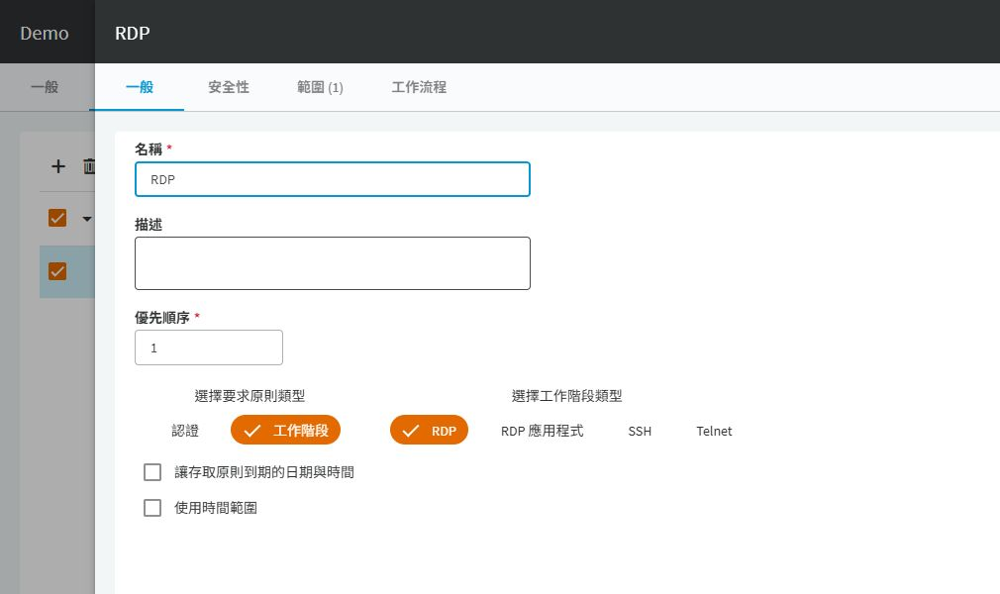

# SPP／SPS 遠端應用程式發佈整合

## 目的

透過已核准的 RDP Application 工作階段啟動指定管理工具，集中控管連線與側錄。

## 適用範圍

本次以 SPP 9.0.0.2807／SPS 9.0.0 核對工作階段類型與 SPS 通道設定；RDS／Launcher 部署仍依 8.0 LTS 官方流程作參考，須另核對實際版本與授權。

## 前置條件

Windows Server RDS 已能發佈測試 RemoteApp，應用程式在工作階段主機可正常執行，SPP／SPS 已整合。RDS CAL 與應用程式授權須另行確認，不能以 Windows Server 的管理用遠端桌面連線取代正式 RDS 授權。

## 操作步驟

> 本篇畫面只展示相關設定入口與通道現況，沒有 RemoteApp 程式啟動結果，不能作為整合成功證據。

### SPP 工作階段類型的實際位置

在 `安全性原則管理 > 權利 > 存取要求原則 > 一般` 選「工作階段」後，可以看到「RDP 應用程式」。應另建專用原則，不把既有一般 RDP 原則直接改成正式 RemoteApp。

圖 1：本圖選中的是一般 RDP；右側 RDP 應用程式是操作入口示意，未切換或儲存。

本次已在 SPS `Traffic Controls > RDP > Channel Policies > safeguard_default` 看到 Dynamic virtual channel，以及 Custom 的 rail、rail_ri、rail_wi。這只證明通道設定存在；尚未登入 RDS 主機核對 Launcher、發佈 Alias、授權與實際啟動。因此以下仍是整合驗收程序，不能宣稱 RemoteApp 已可用。

### 實施與驗收程序（尚未實跑）

1. 架構採「使用者申請 SPP → 核准 → SPS 代理 RDP → RDS 工作階段主機啟動工具 → 目標應用程式」。記錄每一段的來源、目的地、登入帳戶及負責人。
2. 依 SPS 本版指南安裝、設定 RemoteApp Launcher，透過 RDS 發佈 `OISGRemoteAppLauncher`，記錄 Program Name、Alias 與核准的應用程式命令列。
3. 在 SPP 建立 Windows Server 資產代表應用程式主機；另建 Other／Other Managed 資產代表應用程式，Network Address 與 Authentication Type 依官方流程設為 None，並加入應用程式帳戶。
4. 建立專用 Entitlement 與 RDP Application 存取要求原則，填入主機、應用程式帳戶與 RemoteApp 對應資訊，配置核准人及期限。
5. 在 SPS 的 RDP Channel Policy 設定官方要求的 Dynamic virtual channel 與 Custom channels：`rail`、`rail_ri`、`rail_wi`，再由專用 RDP Connection Policy 引用。
6. 用測試使用者申請及核准，確認啟動的是指定程式、登入身分正確、側錄可回放，並測試登出與歸還。
7. 檢查程式的開啟檔案、另存新檔及外部工具功能是否能啟動未核准程式。若能繞出應用程式範圍，先完成 RDS 端限制再開放使用。

## 注意事項

RemoteApp 發佈本身不是完整的應用程式隔離。本專案建議限制 RDS 主機可存取的目標及程式，復原時先撤回測試權利並恢復 SPS 原通道原則。

## 相關文件

- [實機截圖與驗證範圍](environment-evidence.md)
- [官方：SPP 8.0 LTS，Remote Desktop Application](https://support.oneidentity.com/technical-documents/one-identity-safeguard-for-privileged-passwords/8.0%20lts/user-guide/11)
- [Microsoft Learn：RDS CAL](https://learn.microsoft.com/en-us/windows-server/remote/remote-desktop-services/rds-client-access-license)
- [回專案目錄](../../README.md)
