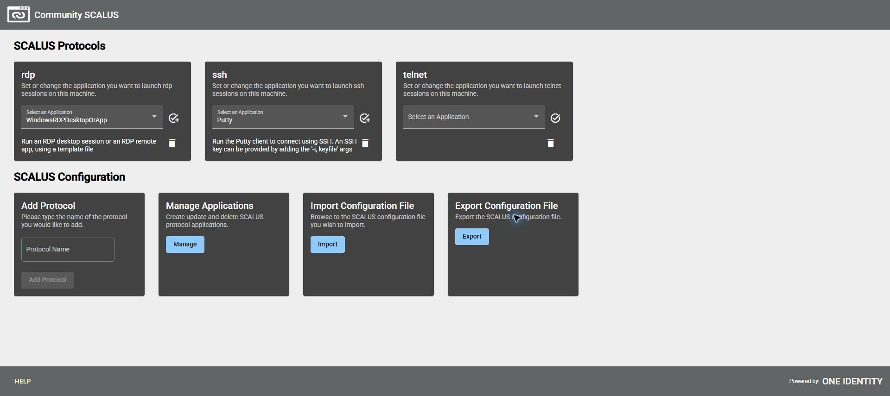
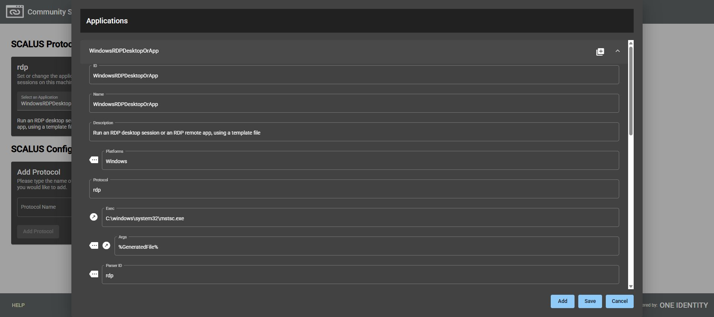
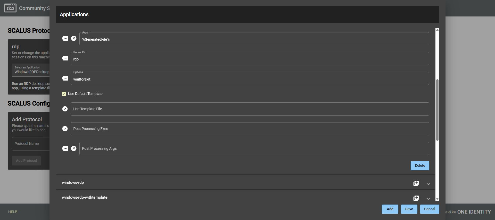
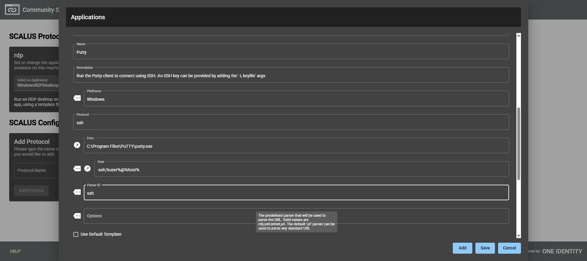

# Windows 安裝與設定 SCALUS

## 目的

讓 SPP 網頁透過 URI 啟動本機 RDP／SSH 用戶端。SCALUS 是協定處理程式的分派工具，不提供目標存取授權。

## 適用範圍

Windows 操作方式依 OneIdentity/SCALUS 官方儲存庫 README；搭配本專案 SPP 8.0 LTS 工作階段。SCALUS 是獨立工具，其版本不等於 SPP 版本。

## 前置條件

具備軟體安裝權限、企業核准的 RDP／SSH 用戶端及一筆可用測試申請。安裝套件從官方 Releases 取得，記錄實際版本，確認來源及檔案完整性。

## 操作步驟

> 截圖範圍：2026-09-30 開啟本機既有 SCALUS，拍攝協定總覽、RDP 與 SSH 應用程式欄位。執行檔版本為 1.1.0.470（本機檔案中繼資料）；未重新安裝、變更設定或執行連線驗收。完整界線見[截圖與驗證範圍](environment-evidence.md)。

1. 從官方 Releases 下載 Windows MSI，完成安裝。官方 README 說明預設位於 `C:\Program Files\SCALUS` 並建立開始功能表捷徑。
2. 由開始功能表開啟 SCALUS。工具會在瀏覽器啟動本機設定介面。
3. 檢查 RDP／SSH 對應的應用程式路徑確實存在。使用工具提供的設定與範例調整，不把實際密碼寫進命令列或設定檔。
4. 到 SPP 使用者偏好確認啟用相應的啟動選項；開啟已核准且仍可用的測試申請。
5. 按下啟動工作階段，瀏覽器詢問外部應用程式時，確認由可信任的 SPP 網址發起並核對程式後再允許。
6. 確認用戶端連到 SPS 並到達正確目標，完成登出及歸還。分別測試 SSH 與 RDP，不能只看 SCALUS 設定頁可開啟就判定成功。

### 本機協定對應總覽

由開始功能表開啟 **SCALUS**，瀏覽器會顯示本機設定頁。本次網址是 `http://localhost:38493/index.html`，連接埠僅為此次觀察值；操作時使用工具實際開啟的頁面，不要把此網址當成所有電腦的固定入口。官方啟動方式見本文末的 README。

畫面上 `rdp` 已選擇 `WindowsRDPDesktopOrApp`，`ssh` 已選擇 `Putty`，`telnet` 尚未選擇應用程式。這表示設定頁的對應現況，不能據此認定 Windows 協定關聯或遠端登入已測試成功。只核對設定時，不需要切換選單、按協定圖示或匯入設定。

### 核對 RDP 執行程式與範本

在 **Manage Applications → Manage** 開啟 **Applications**，展開 `WindowsRDPDesktopOrApp`。下表是本機既有值，供辨識欄位，不是要求每個環境照抄。

| 欄位 | 本機觀察值 |
|---|---|
| Platforms／Protocol | `Windows`／`rdp` |
| Exec | `C:\windows\system32\mstsc.exe` |
| Args | `%GeneratedFile%` |
| Parser ID | `rdp` |
| Options | `waitforexit` |
| Use Default Template | 已勾選 |
| Use Template File | 空白 |
| Post Processing Exec／Args | 空白 |

向下捲動同一個對話方塊，可看到範本與後處理欄位。

本次另以檔案系統確認 `mstsc.exe` 路徑存在。`%GeneratedFile%` 是畫面中的 SCALUS 變數，應保留原樣；不要改成帳戶密碼，也不要把這段文字直接當成 PowerShell 命令執行。RemoteApp 的伺服器端條件與驗收另見 [RemoteApp 串接](remoteapp-integration.md)。

### 核對 SSH 應用程式

在同一個 **Applications** 對話方塊展開 `putty-ssh`，其 **Name** 為 `Putty`，對應首頁 SSH 下拉選單中的名稱。捲動至 **Exec** 與 **Args** 核對下列既有值。

| 欄位 | 本機觀察值 |
|---|---|
| Platforms／Protocol | `Windows`／`ssh` |
| Exec | `C:\Program Files\PuTTY\putty.exe` |
| Args | `-ssh,%user%@%host%` |
| Parser ID | `ssh` |
| Use Default Template | 未勾選 |

本次確認 PuTTY 路徑存在，但沒有啟動 SSH 工作階段。畫面中的 Args 未明列連接埠變數，因此使用非預設 SSH 連接埠時，仍須依官方設定說明核對參數傳遞並實測，不能只憑首頁選到 Putty 就認定可用。`%user%`、`%host%` 是 URI 解析變數，不是要填入真實帳密的佔位欄位。

完成檢視後按 **Cancel** 返回首頁。本次沒有按 **Save**、新增／刪除協定或使用 Import。正式驗收仍須依前述步驟，從 SPP 已核准的申請啟動 RDP／SSH，記錄目標、連接埠、實際結果及 SPS 側錄。

## 注意事項

SCALUS 官方將工具描述為一般用途 URI dispatcher；支援責任與企業核准版本應獨立確認。本專案建議避免對所有網站永久允許啟動外部程式。

若協定關聯衝突，先記錄原有關聯再調整。RDP 可依 SPP 官方流程改用下載的啟動檔，不需為測試而停用瀏覽器安全機制。

## 相關文件

- [官方：SCALUS README](https://github.com/OneIdentity/SCALUS)
- [官方：SCALUS Releases](https://github.com/OneIdentity/SCALUS/releases)
- [使用者工作階段流程](spp-session-workflow.md)
