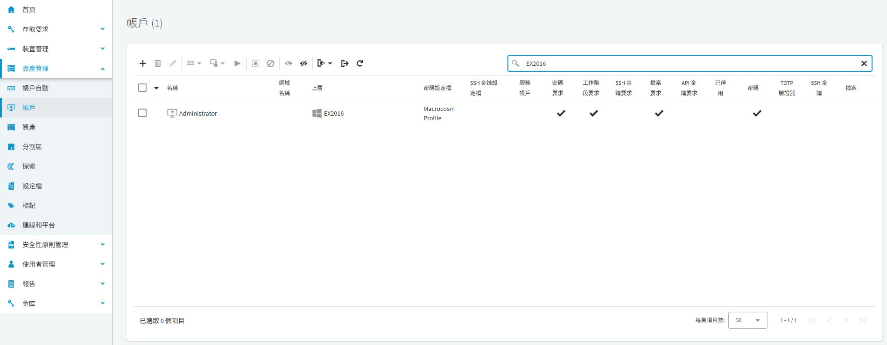
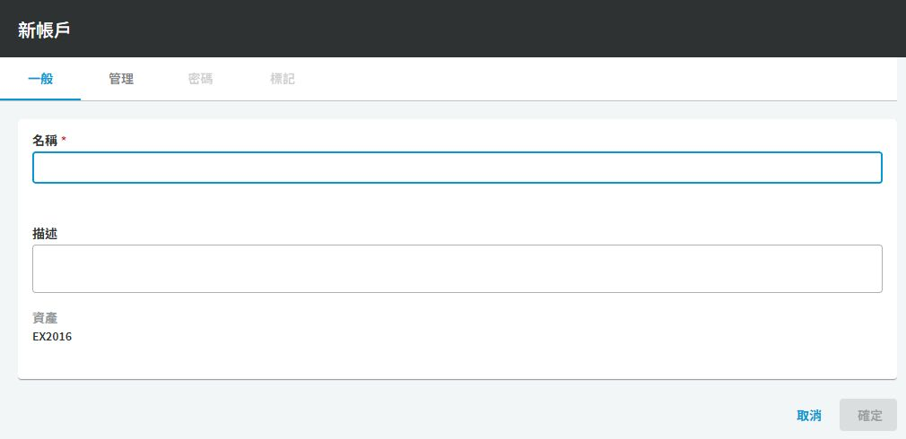
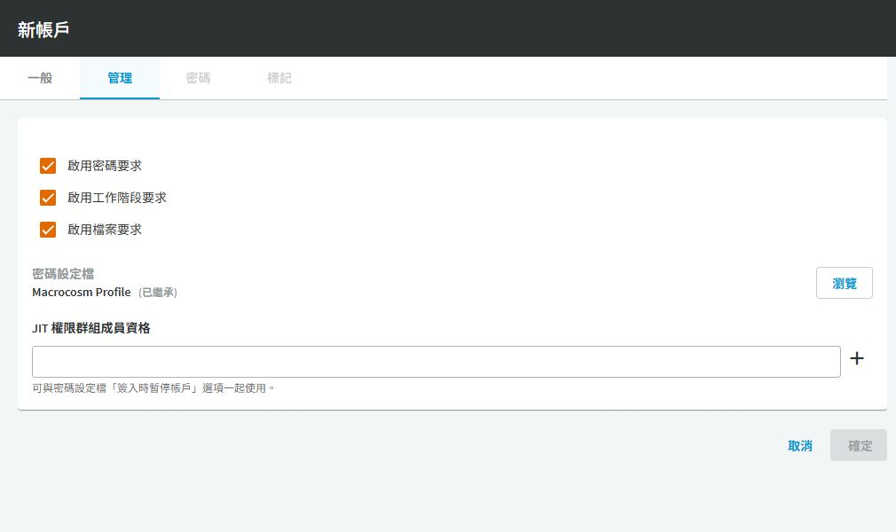

# SPP 新增納管帳戶

## 目的

將既有 Windows、Linux 登入帳戶加入密碼保險箱，供後續存取原則使用。SPP 使用者是申請人；資產帳戶則是登入目標主機的身分，兩者不可混用。

## 適用範圍

畫面與中文操作名稱於 2026-09-30 以 SPP 9.0.0.2807 Web 用戶端核對；文末 8.0 LTS 官方文件作為原理參考，不代表所有 9.0 行為均已驗證。 新增納管紀錄不會替作業系統建立使用者。

## 前置條件

已完成[新增資產](../../spp_asset.md)，操作者具有 Asset Administrator 或適當分割區委派權限。目標帳戶已存在，且有 RDP 或 SSH 登入權限。先確認目標帳戶沒有尚未盤點的服務、排程或應用程式相依性。

## 操作步驟

### 從資產找到正確的帳戶

開啟 `資產管理 > 帳戶`，在搜尋欄輸入資產名稱，再核對「名稱」與「上層」欄位。相同的 Administrator 可以存在不同資產上，不能只看帳戶名稱。

圖 1：EX2016 下現有 Administrator 帳戶；勾號是已啟用功能或已存有密碼，不代表密碼檢查成功。

按工具列左側 `＋`，在「選取新帳戶的資產」選取目標，按「選取資產」。進入「新帳戶 > 一般」後，名稱要填目標作業系統已存在的帳戶；資產若選錯，取消後重選。

圖 2：空白新增表單，未建立帳戶。名稱未填時「確定」不可用。

切到「管理」，逐項核對可申請的功能與有效密碼設定檔。

| 畫面欄位 | 操作判斷 |
|---|---|
| 啟用密碼要求 | 只有需要取出密碼時才開放 |
| 啟用工作階段要求 | 使用 RDP／SSH 代登入時需要；仍須另建權利 |
| 啟用檔案要求 | 依實際檔案保管需求設定，不因畫面預先勾選就沿用 |
| 密碼設定檔（已繼承） | 表示取用上層設定；按「瀏覽」才是明確指派其他設定檔 |

圖 3：實機新增畫面的既有勾選狀態。正式值應依需求收斂，Macrocosm Profile 不是本文件建議的正式原則。

儲存後重新開啟帳戶，使用「內容 > 密碼」完成密碼登錄與檢查。截圖中的 EX2016 只是既有資產名稱，不是新建 Exchange 環境的版本建議；本文操作範例仍以 WinSrv／LoginUser 與 ubuntu／loginuser 說明。

### 實施與驗收程序（尚未實跑）

1. 開啟 `資產管理 > 帳戶`，按 `＋` 新增帳戶，選取 WinSrv 資產。
2. 在「一般」 輸入 `LoginUser`，以描述註明擁有人與用途。本例是本機帳戶；網域帳戶應從目錄資產選取，不要在每台成員伺服器重建同一份帳戶紀錄。
3. 在管理設定確認有效的 Password Profile。先使用不會自動變更密碼的測試設定檔，避免繼承分割區預設排程後立即輪替。
4. 啟用此帳戶的 Session Request；若沒有取出密碼的業務需求，不另外啟用 Password Request。儲存後，使用帳戶密碼設定功能登錄目標目前的密碼，不要把「設定保險箱內的密碼」當成已完成目標主機的密碼變更。
5. 對 ubuntu 重複上述步驟，輸入 `loginuser`，留意 Linux 名稱大小寫。
6. 若資產已完成[服務帳戶設定](spp-service-account.md)，執行 `Check Password`，確認成功並保留作業時間與結果。資產驗證類型仍為 None 時，不把新增成功視為自動密碼管理已驗證。
7. 完成[新增權利與存取原則](spp-entitlements.md)，用 u01 申請、a01 核准，分別測試 RDP 與 SSH。

## 注意事項

服務帳戶與供人員申請的登入帳戶應分開。密碼不寫入文件、截圖或工單。若輸入錯誤，修正保險箱中的值後再檢查，避免連續驗證造成目標帳戶鎖定。

驗收應記錄資產、帳戶、申請編號與側錄識別資訊，確認登入的是預期主機及使用者。

## 相關文件

- [實機截圖與驗證範圍](environment-evidence.md)
- [官方：SPP 8.0 LTS，Adding an account](https://support.oneidentity.com/technical-documents/one-identity-safeguard-for-privileged-passwords/8.0%20lts/administration-guide/53)
- [官方：帳戶存取服務與設定檔](https://support.oneidentity.com/technical-documents/one-identity-safeguard-for-privileged-passwords/8.0%20lts/administration-guide/79)
- [回專案目錄](../../README.md)
