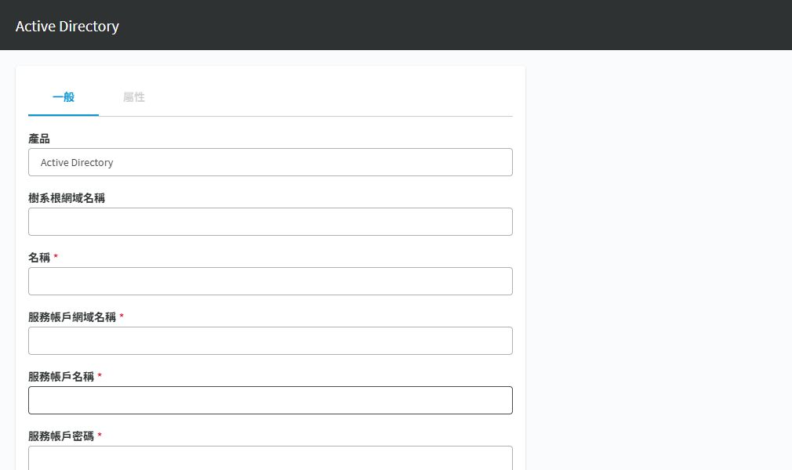

# SPP 整合 Active Directory 登入

## 目的

讓既有 AD 使用者登入 SPP，再透過 SPP 權利控制申請範圍。AD 登入整合與 AD 特權帳戶密碼納管是不同設定。

## 適用範圍

畫面與中文操作名稱於 2026-09-30 以 SPP 9.0.0.2807 Web 用戶端核對；文末 8.0 LTS 官方文件作為原理參考，不代表所有 9.0 行為均已驗證。 本篇處理平台登入，不變更 AD 帳戶密碼。

## 前置條件

Appliance Administrator 與 User Administrator 分工完成提供者及使用者設定。SPP 能解析網域與網域控制站名稱，時間同步正常。準備專用目錄讀取帳戶；官方說明，僅供身分與驗證用途時只需要目錄讀取權限。

## 操作步驟

### AD 提供者的欄位對照

進入 `裝置管理 > Safeguard 存取 > 識別與驗證`，按 `＋` 下拉選單，選 `Active Directory`。

圖 1：新增提供者的上半部欄位；未填入憑證、未建立提供者。

| 畫面欄位 | 要填的資料 |
|---|---|
| 樹系根網域名稱 | 目標樹系根網域 FQDN，不是 SPP 網址 |
| 名稱 | 在 SPP 辨識登入來源的顯示名稱 |
| 服務帳戶網域名稱 | 目錄讀取帳戶所在網域 |
| 服務帳戶名稱／密碼 | 經核准的讀取身分及目前憑證 |
| 連線 | 驗證連線並取得可用網域；不是完成使用者授權 |
| 可用於識別與驗證的網域 | 連線後只選需要的網域 |
| 使用 SSL 加密 | 按憑證與目錄連線設計設定，核對名稱及信任鏈 |

下半部的「連線」、「可用於識別與驗證的網域」及 SSL 選項須向下查看。現場已有 AD 提供者，但本次未測試登入或修改它。

### 實施與驗收

1. 保留已驗證可登入的本機管理員，記錄網域 FQDN、服務帳戶、憑證信任與允許匯入的測試使用者。
2. 到 `Appliance Management > Safeguard Access > Identity and Authentication` 新增 Active Directory 提供者，輸入目錄連線資料與服務帳戶憑證。
3. 若樹系有多個網域，選取要提供登入的網域，不假設所有網域均自動納入。
4. 測試目錄連線與查詢；若使用 TLS，核對網域控制站憑證、名稱與信任鏈，不以忽略憑證錯誤作為修正。
5. 在使用者管理加入一個目錄測試使用者，核對來源提供者及登入名稱。僅授予測試權利，不授管理權限。
6. 以獨立瀏覽器工作階段選取 AD 提供者登入，確認只看得到指定申請範圍；再測試未獲授權的使用者。
7. 記錄登入、匯入與停用流程，確認離職／停權作業如何同步撤回 SPP 存取權。

## 注意事項

本專案建議先用單一測試使用者，再導入群組。群組匯入不代表存取權已完成，仍須設定 Entitlement。失敗時使用保留的本機管理員調整提供者或使用者對應。

要輪替 AD 特權帳戶，另建立目錄資產與適當重設密碼委派權限，不要擴大本篇的讀取帳戶權限來混用。

## 相關文件

- [實機截圖與驗證範圍](environment-evidence.md)
- [官方：SPP 8.0 LTS，Identity and Authentication](https://support.oneidentity.com/technical-documents/one-identity-safeguard-for-privileged-passwords/8.0%20lts/administration-guide/48)
- [官方：Active Directory 提供者及服務帳戶權限](https://support.oneidentity.com/it-it/technical-documents/one-identity-safeguard-for-privileged-passwords/8.0%20lts/administration-guide/49)
- [權利設定](spp-entitlements.md)
