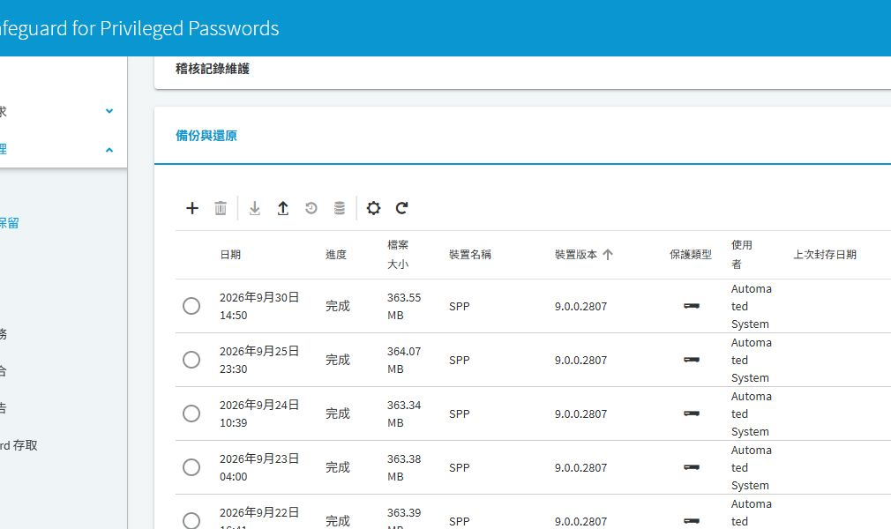

# SPP 備份與還原驗證

## 目的

建立可離機保存、具備解密條件且經還原驗證的 SPP 備份。

## 適用範圍

畫面與中文操作名稱於 2026-09-30 以 SPP 9.0.0.2807 Web 用戶端核對；文末 8.0 LTS 官方文件作為原理參考，不代表所有 9.0 行為均已驗證。 SPP 備份與 SPS 側錄保存須分別驗收。

## 前置條件

具備 Appliance Administrator 權限，已確認備份目的地、保存期限、加密密碼或 GPG 私密金鑰保管人。若整合 HSM，另確認還原所需金鑰與存取條件。

## 操作步驟

> 截圖是備份清單的局部畫面，未包含完整導覽路徑；既有完成紀錄不代表本次執行過備份或還原。

### 從完成清單核對備份

進入 `裝置管理 > 備份與保留`，展開「備份與還原」。同頁還有「封存伺服器」、「稽核記錄維護」與「備份保留」。

圖 1：既有自動備份清單。2026-09-30 14:50 的項目顯示完成、363.55 MB、版本 9.0.0.2807；不是本次手動建立的備份。

核對「日期」、「進度」、「檔案大小」、「裝置版本」，再核對保護方式與離機保存結果。此清單可證明裝置曾產生備份紀錄，不能證明備份檔已離機或已還原成功。工具列齒輪用於備份設定，滑鼠移至圖示確認名稱後再操作，避免把上傳、下載、還原及封存混用。

本次未下載備份、未執行還原，也未改動排程。正式驗收要另記下載或封存位置、檔案雜湊、解密材料保管人與隔離還原結果。

### 實施與驗收程序（尚未實跑）

1. 到 `裝置管理 > 備份與保留`，檢查 Backup protection settings 與備份排程。記錄目前版本、叢集角色與保護方式。
2. 需要離機傳送時，先設定 Archive servers，再於備份設定選取目的地。
3. 開啟 `Backup and Restore`，執行 `Run Now`。若要求加密密碼，透過核准的保密方式輸入。
4. 等待工作完成，確認 `.sgb` 檔案已產生；下載或傳送至指定位置後，核對檔案時間、大小與可讀取性，將解密材料分開保存。
5. 排程備份並檢查下一次結果。保存失敗告警的接收人與處理責任。
6. 在隔離、相容的測試環境執行正式還原演練；禁止測試裝置連到正式目標執行輪替。依官方 Restore a backup 程序還原，驗證登入、資產、帳戶及原則可用，記錄耗時與結果。

## 注意事項

備份建立當時進行中的存取要求流程不會完整恢復。還原也不會把目標主機密碼倒回備份當時，必須另作密碼一致性檢查。舊備份與本機密碼最長存留期可能造成登入鎖定，演練前先閱讀官方限制。

本專案建議依核准的 RPO／RTO 設計排程與演練頻率；檔案存在不等於可還原，也不要以虛擬機器快照取代產品備份。

## 相關文件

- [實機截圖與驗證範圍](environment-evidence.md)
- [官方：SPP 8.0 LTS，Backup and Restore／Run Now](https://support.oneidentity.com/technical-documents/one-identity-safeguard-for-privileged-passwords/8.0%20lts/administration-guide/28)
- [官方：SPP 8.0 LTS 管理指南](https://support.oneidentity.com/technical-documents/one-identity-safeguard-for-privileged-passwords/8.0-lts/administration-guide)
