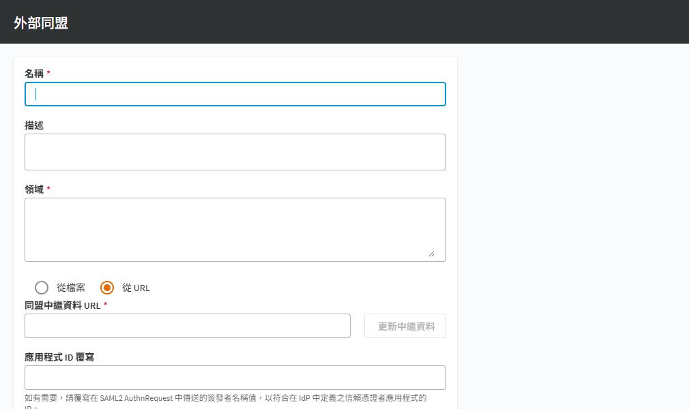

# SPP 整合 Microsoft Entra ID

## 目的

透過 SAML External Federation 讓使用者以 Entra ID 登入 SPP，並維持 SPP 端的獨立授權。

## 適用範圍

畫面與中文操作名稱於 2026-09-30 以 SPP 9.0.0.2807 Web 用戶端核對；文末 8.0 LTS 官方文件作為原理參考，不代表所有 9.0 行為均已驗證。 Entra ID 端沿用 One Identity KB 4360719；本次僅核對 SPP 表單。

## 前置條件

準備 SPP Appliance Administrator、可管理企業應用程式的租用戶管理身分，以及一個測試使用者。記錄正式登入 FQDN／VIP、名稱解析與憑證；保留可用的本機緊急管理帳戶。

## 操作步驟

> metadata 下載等未入鏡操作不由本圖證明；此圖只證明新增提供者表單，不能證明 Entra ID 整合成功。

### SPP 端的外部同盟入口

到 `裝置管理 > Safeguard 存取 > 識別與驗證`，按 `＋ > 外部同盟`。「領域」對應 Realm；「從檔案」用於匯入 Entra ID XML，「從 URL」則需提供核准的中繼資料網址。

圖 1：空白外部同盟表單，不含租用戶識別、metadata、簽章或權杖。

表單下方有「下載 Safeguard 同盟中繼資料」。將此檔提供 Entra ID 管理者，依檔內實值設定 Identifier 與回覆 URL。不要把 SPP metadata 與 Entra ID metadata 傳反，也不要將「應用程式 ID 覆寫」當成固定必填值。

現場已有名為 Microsoft Entra ID 的提供者；本次未登入 Entra 管理中心、未調整 claims 或條件式存取，也未測試 SAML 往返。以下 Entra 端步驟依官方 KB，需由租用戶管理者完成驗收。

### 實施與驗收程序（尚未實跑）

1. 在 SPP `Identity and Authentication` 新增 External Federation，Realm 使用測試使用者的登入尾碼，下載 SPP Federation Metadata。
2. 在 Entra ID 建立非資源庫企業應用程式並設定 SAML 單一登入。Identifier 使用 SPP metadata 的 entityID；Reply URL 登錄實際使用的 `https://<CUSTOMER_SPP_FQDN>/RSTS/Login`。不要自行把 entityID 中的 http 改為 https。
3. 依 KB 設定 NameID 使用 `user.userprincipalname` 或 `user.mail`，並讓 SPP 對應屬性一致。採用 KB 的單一 NameID 做法時，移除額外 claims，避免不同識別值互相衝突。
4. 將測試使用者指派到企業應用程式。下載 Entra ID Federation Metadata XML，匯入 SPP 的 External Federation 提供者並儲存。
5. 將 SPP 測試使用者的驗證提供者及 claim 對應至此設定；若身分來源是 AD，核對 External Federation Authentication 屬性使用 mail 或 userPrincipalName。
6. 用獨立瀏覽器從 SPP 發起登入，確認導向 Entra ID、完成驗證並回到正確使用者。測試未指派者不能使用，且成功登入者只具備預期權利。
7. 建立簽署憑證到期與 metadata 更新責任，留存測試日期及不含權杖內容的結果紀錄。

## 注意事項

SPP 要求 SAML Response 或 Assertion 簽署且不加密；憑證輪替時須更新相應 metadata。登入成功不會自動取得資產存取權。[官方驗證規格](https://support.oneidentity.com/technical-documents/one-identity-safeguard-for-privileged-passwords/8.0%20lts/administration-guide/154)

本專案建議先以測試群組套用 MFA／條件式存取，授權與原則由租用戶管理者依實際方案確認。不要在文件中附完整 SAML assertion、簽章、Token 或含個資的 metadata 截圖。

## 相關文件

- [實機截圖與驗證範圍](environment-evidence.md)
- [官方：KB 4360719，Entra ID Federation 設定](https://support.oneidentity.com/one-identity-safeguard-for-privileged-passwords/kb/4360719/configuring-microsoft-s-azure-ad-federation-with-safeguard)
- [AD 登入整合](spp-active-directory.md)
- [權利設定](spp-entitlements.md)
