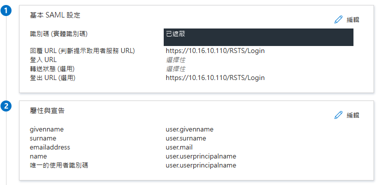
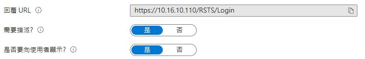
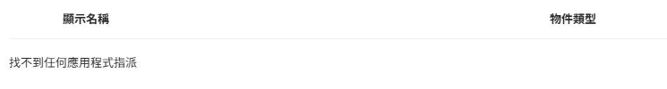
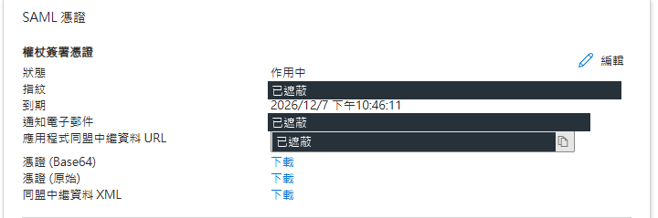
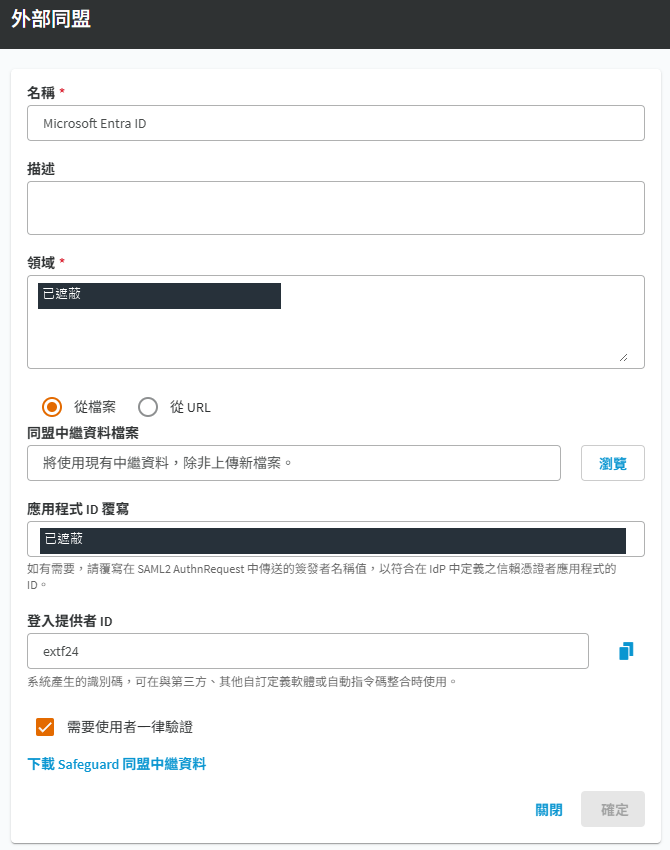
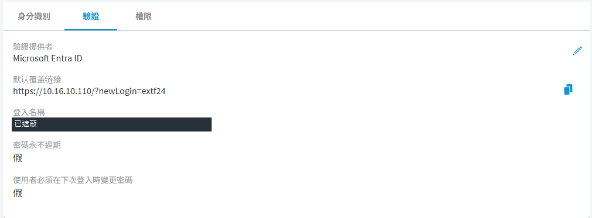

# SPP 整合 Microsoft Entra ID

## 目的

以 SAML 2.0 外部同盟讓使用者透過 Microsoft Entra ID 驗證身分，再由 SPP 決定可使用的功能與資產。企業應用程式指派、SPP 使用者對應及 SPP 權利必須分別完成，登入成功不代表已取得資產權限。

## 適用範圍

本文適用於 SPP 9.0，示範介面版本為 9.0.0.2807。圖中的 10.16.10.110 是範例設備位址，部署時請換成客戶核准的正式登入位址。

圖中深色區塊為已遮蔽的環境識別資訊，並非空白設定。

原廠 KB 與 8.0 LTS 指南用於設定及欄位參考，不代表已驗證 9.0 全部行為。實施時以目標設備 metadata、實際 SAML 要求及相符版本文件核對。本文不涵蓋 SPS 管理介面的 SAML 整合或自動佈建使用者。

## 前置條件

SPP Appliance Administrator 負責提供者設定，使用者與權利由具相應管理權限的人員處理。Entra ID 的 SAML 設定可由 Cloud Application Administrator、Application Administrator 或該服務主體擁有者處理，不必一律使用 Global Administrator。[Microsoft 設定權限](https://learn.microsoft.com/en-us/entra/identity/enterprise-apps/add-application-portal-setup-sso)

保留已測試可用的 SPP 本機緊急管理帳戶。備份現有同盟、使用者驗證方式、AD 屬性對應與企業應用程式設定，先以一個非管理員使用者驗收，再擴大範圍。

### 施工欄位表

| 項目 | 填寫內容與核對方式 |
|---|---|
| SPP 版本 | `<CUSTOMER_SPP_VERSION>`，含組建號碼 |
| 正式登入名稱 | `<CUSTOMER_SPP_FQDN>`，另列實際使用的 VIP 或節點名稱 |
| 外部同盟名稱 | 本案例為 `Microsoft Entra ID`，同一設備內不可重複 |
| Realm | `<CUSTOMER_LOGIN_SUFFIX>`，與實際登入識別值尾碼一致 |
| 測試使用者 | `<CUSTOMER_TEST_UPN>`，採非管理員帳戶 |
| NameID 來源 | 本案例為 `user.userprincipalname`；另保留 emailaddress 等宣告 |
| SPP 使用者來源 | 手動維護，或既有 AD 目錄使用者 |
| SPP metadata | 由目標 SPP 下載，提供給 Entra ID 管理者 |
| Entra ID metadata | 由指定企業應用程式下載，匯入 SPP |
| 憑證維護窗口 | `<CUSTOMER_CERT_OWNER>` 與實際簽署憑證到期日 |

瀏覽器必須能透過 HTTPS 到達 Entra ID 及正式 SPP 登入名稱，並信任其 TLS 憑證；確認 DNS 與設備時間正常。本文建議採既有 VPN 或核准的內部存取路徑，不因 SAML 整合直接新增對外 DNAT。若採 metadata URL，SPP 各節點也須能連線並信任其憑證。

## 操作步驟

### 第一階段 取得 SPP 服務提供者資料

1. 進入「裝置管理 > Safeguard 存取 > 識別與驗證」，按「＋ > 外部同盟」。
2. 名稱填 `Microsoft Entra ID`，領域填 `<CUSTOMER_LOGIN_SUFFIX>`。Realm 是使用者登入尾碼，不是 SPP 主機名稱，也不一定是 onmicrosoft.com 網域。
3. 按下方「下載 Safeguard 同盟中繼資料」，保存原始 XML。新增時先保留表單，不以空白 metadata 建立提供者；既有提供者可直接下載。
4. 從 XML 讀取 `entityID`，保留原字串。即使開頭是 `http://`，也不能自行改成 `https://`；它是識別碼，不代表登入流量採 HTTP。[原廠設定程序](https://support.oneidentity.com/one-identity-safeguard-for-privileged-passwords/kb/4360719/configuring-microsoft-s-azure-ad-federation-with-safeguard)

案例已使用「應用程式 ID 覆寫」，須同時比對第二階段 Entra Identifier 與第三階段 SPP 覆寫值。新環境若不覆寫，就使用目標 SPP metadata 的 entityID；不可直接套用案例的識別碼。

### 第二階段 設定 Entra ID 企業應用程式

沿用案例時，在 Azure Portal「Microsoft Entra ID > 企業應用程式 > 所有應用程式」開啟既有的 `One Identity Safeguard`，再選「單一登入」，不要重建。新部署才選「新增應用程式 > 建立您自己的應用程式」，選擇整合不在資源庫中的應用程式，建立後選 SAML。[Microsoft 建立流程](https://learn.microsoft.com/en-us/entra/identity/enterprise-apps/validate-saml-single-sign-on-app-gallery)

#### 基本 SAML 設定

| Entra ID 欄位 | SPP 對應與填寫規則 |
|---|---|
| 識別碼 Identifier Entity ID | 本案例與 SPP「應用程式 ID 覆寫」相同；未覆寫時使用 metadata 的 `entityID` 原值 |
| 回覆 URL Reply URL | 本案例為 `https://10.16.10.110/RSTS/Login`；客戶換成正式入口 |
| 其他回覆 URL | 只加入實際允許使用的 VIP 或節點端點，逐一核對 |
| 登入 URL Sign on URL | 本案例未填。若需從入口啟動 SP 流程，依實際設計設定 |

可使用 Entra 的上傳中繼資料功能帶入 SPP 資料，但匯入後仍須逐欄核對。若目標設備 metadata 或登入要求與 KB 路徑不同，先確認版本與實際 ACS，再採用該設備正確值；不要同時加入猜測路徑來掩蓋差異。

圖 1：Azure Portal 的基本 SAML 設定與宣告。Reply URL 為 `/RSTS/Login`，Identifier 已遮蔽，保留五個宣告的對應。本案例登出 URL 也填 `/RSTS/Login`，但此圖不證明 SAML Single Logout 已正常運作，不將它列為客戶必填值。

#### 屬性與宣告

本文保留案例原有的宣告，不要求為了跟文件一致而刪除。Azure Portal 實機核對 NameID 格式為 `Email Address`，來源是 `user.userprincipalname`，其他對應如下。

| 宣告 | 本案例來源 |
|---|---|
| 唯一使用者識別碼 NameID | `user.userprincipalname` |
| emailaddress | `user.mail` |
| name | `user.userprincipalname` |
| givenname | `user.givenname` |
| surname | `user.surname` |

SPP 對應不能只看 NameID。官方欄位說明指出，存在 emailaddress 時優先使用該 claim，其次為 name；因此本案例須先核對 `user.mail` 實際值與 SPP 登入名稱一致。只有未提供這兩個標準屬性宣告時，才依原廠同盟規格使用 Subject NameID。UPN 與郵件地址可能不同，畫面上的來源屬性名稱無法證明兩者實際值相同。[SPP claim 對應欄位](https://support.oneidentity.com/fr-fr/technical-documents/one-identity-safeguard-for-privileged-passwords/8.0%20lts/administration-guide/111)、[同盟 NameID 備援規則](https://support.oneidentity.com/technical-documents/one-identity-safeguard-for-privileged-passwords/7.0.4.2%20lts/administration-guide/136)

KB 4360719 另提供「只保留 NameID、移除 Additional Claims」的做法，可用來簡化識別值。這是替代方案，不是本案例現況，也不是既有環境的必改項；若採用，需重新核對 SPP 對應並驗收。[原廠單一 NameID 方案](https://support.oneidentity.com/one-identity-safeguard-for-privileged-passwords/kb/4360719/configuring-microsoft-s-azure-ad-federation-with-safeguard)

#### 使用者指派與中繼資料

本案例「屬性 Properties > 需要指派」已為「是」。到「使用者和群組」選「新增使用者/群組」，加入核准的非管理員測試使用者，核對後完成指派。本文建議先直接指派單一使用者。群組指派需要 Entra ID P1 或 P2，巢狀群組不可當作有效指派依據。[Microsoft 指派規則](https://learn.microsoft.com/en-us/troubleshoot/entra/entra-id/app-integration/error-code-AADSTS50105-user-not-assigned-role)

圖 2：企業應用程式屬性中，「需要指派」與「是否要向使用者顯示」均為「是」。

圖 3：使用者與群組頁面顯示「找不到任何應用程式指派」。請先指派測試使用者，再進行登入驗收。Global Administrator 可不受此指派要求限制，因此不能用管理員登入結果替代一般帳戶驗收。

回到 SAML 頁面，在「SAML 憑證」下載「同盟中繼資料 XML」，記錄簽署憑證到期日。將檔案標示為 Entra ID 端，避免與 SPP XML 傳反。

圖 4：SAML 憑證設定，狀態為作用中，到期日為 2026/12/7，可由「同盟中繼資料 XML」下載。通知信箱、指紋與 metadata URL 已遮蔽；到期日只屬於本案例。

### 第三階段 完成 SPP 外部同盟

回到第一階段表單，選「從檔案」，按「瀏覽」匯入 Entra ID 企業應用程式的 XML。核對名稱、Realm 與檔案來源後儲存。既有案例顯示「將使用現有中繼資料，除非上傳新檔案」，表示沿用已匯入的內容，未更新 metadata 時不需重新上傳。

本案例「應用程式 ID 覆寫」已填入一個 HTTPS 識別值，與圖 1 的 Entra Identifier 相同。這是 SAML 識別值，不是 Entra 應用程式 Client ID。沿用此設計時兩端須完全一致；新環境是否需要覆寫，依目標設備及 IdP 設計決定，不視為固定必填。

圖 5：SPP 外部同盟設定。名稱為 Microsoft Entra ID，採「從檔案」，已設定應用程式 ID 覆寫，且勾選「需要使用者一律驗證」；Realm 與覆寫值已遮蔽。

「需要使用者一律驗證」屬於重新驗證行為，不是建立使用者或授權的替代操作。本案例已勾選；其他環境是否啟用按客戶需求決定，並在已有 Entra 工作階段時測試登入提示；不能把勾選此項當成每次 MFA 已生效。啟用後，須一併驗證 SPP 9.0 與客戶條件式存取原則的組合行為。

從檔案匯入時，SPP 保存靜態 metadata，後續簽署憑證輪替須安排更新。採 URL 時，確認所有節點連線與 TLS 信任，並驗證更新及各節點登入。不要直接編輯帶數位簽章的 XML。[原廠 metadata 維護說明](https://support.oneidentity.com/technical-documents/one-identity-safeguard-for-privileged-passwords/7.4.2/administration-guide/frequently-asked-questions/how-do-i-configure-external-federation-authentication/how-do-i-add-an-external-federation-provider-trust)

### 第四階段 對應 SPP 使用者與權利

#### 手動維護的 SPP 使用者

適用於未由 AD 匯入、需在 SPP 個別維護的使用者。在「使用者」新增手動使用者，完成身分基本資料，再到「內容 > 驗證」將驗證提供者選為 `Microsoft Entra ID`。本案例畫面顯示「登入名稱」，填入 SPP 採用的 claim 實際值 `<CUSTOMER_LOGIN_CLAIM>`；保留 emailaddress 的流程優先核對 mail 值。較早版本稱為「Email Address or Name Claim」。不能只改使用者名稱就認為對應已完成。[原廠使用者驗證欄位](https://support.oneidentity.com/fr-fr/technical-documents/one-identity-safeguard-for-privileged-passwords/8.0%20lts/administration-guide/111)

圖 6：使用者的「內容 > 驗證」頁面，驗證提供者為 Microsoft Entra ID，登入名稱已遮蔽。預設覆蓋連接含該環境的登入提供者 ID，不可直接複製為其他客戶的網址。

識別提供者描述資料來源，驗證提供者描述如何驗證，兩者用途不同。不要為單一登入建立重複使用者，也不要假設 Entra 指派後會自動佈建至 SPP。

#### 已由 AD 匯入的 SPP 使用者

保留 AD 身分來源，將測試使用者的驗證提供者設為本次外部同盟。到 AD 提供者「屬性 Attributes」，核對「External Federation Authentication」。修改此對應可能影響同一 AD 提供者的其他使用者，先列出影響範圍。[官方 AD 對應規則](https://support.oneidentity.com/one-identity-safeguard-for-privileged-passwords/kb/4360719/configuring-microsoft-s-azure-ad-federation-with-safeguard)

| SPP 實際採用的識別值 | SPP AD 屬性對應 | 驗收條件 |
|---|---|---|
| name 或僅有 NameID，來源為 `user.userprincipalname` | `userPrincipalName` | 雲端送出值與地端該屬性值相同 |
| 優先採用 emailaddress，來源為 `user.mail` | `mail` | 兩端郵件值相同且不為空 |

選到相同屬性名稱還不夠。若地端使用內部 UPN 尾碼，雲端使用不同網域，須先解決實際值不同的問題。

#### 配置所需權利

一般使用者不需要在「權限」頁勾選 Appliance Administrator。申請人依職務加入 SPP 權利指定的使用者或群組，套用必要的存取要求原則及資產範圍。Appliance Administrator 是設備管理角色，不是一般使用者登入的必要條件。登入後沒有資產時，應核對權利及範圍，不以增加管理員角色作為修正。[SPP 權利設定](spp-entitlements.md)

### 第五階段 登入驗收與回復

用獨立瀏覽器工作階段從正式 SPP URL 發起登入，選外部同盟並輸入測試識別值。確認導向預期租用戶、完成驗證、回到正確 SPP 身分，再核對權利。多個允許入口須分別測試。

| 測試項目 | 通過條件 | 留存紀錄 |
|---|---|---|
| 已指派一般使用者 | Entra 驗證後回到正確 SPP 身分 | 時間、入口、遮蔽身分後的結果 |
| 未指派一般使用者 | 需要指派為「是」時被拒絕 | Entra 錯誤代碼與時間 |
| SPP 權利 | 只能看見及申請核准範圍 | 權利、資產範圍及結果 |
| MFA 與條件式存取 | 登入記錄顯示預期原則及驗證結果 | 原則名稱與成功或失敗狀態 |
| VIP 或節點入口 | 各核准端點能完成往返 | 入口清單及結果 |
| 緊急管理登入 | 同盟異常仍有核准管理路徑 | 本機登入結果，不記密碼 |

負向驗收採非管理員帳戶。Global Administrator 不適合用來測試「未指派應拒絕」；也不要為消除 AADSTS50105 而關閉需要指派。[Microsoft 驗收注意事項](https://learn.microsoft.com/en-us/troubleshoot/entra/entra-id/app-integration/error-code-AADSTS50105-user-not-assigned-role)

切換失敗時保留管理連線，以本機緊急帳戶恢復測試使用者原本驗證提供者及必要的 AD 對應，再依備份還原本次變更的企業應用程式設定。不要刪除仍被其他人使用的提供者。記錄回復內容，確認原登入方式恢復後才結束變更。

## 注意事項

### 常見問題判斷

| 現象 | 優先核對 |
|---|---|
| AADSTS50011 或回覆 URL 不符 | 比對要求中的 Reply URL 與已登錄清單，核對主機名稱及完整路徑 |
| AADSTS50105 | 是否需要指派，以及使用者是否有直接或有效群組指派 |
| Entra 成功但 SPP 拒絕 | NameID 實值、SPP 驗證提供者、claim 或 AD 屬性值 |
| 登入後沒有可申請資產 | SPP 權利、群組與存取要求原則範圍 |
| 更新憑證後失敗 | 是否更新正確應用程式 metadata，各節點是否取得有效簽署憑證 |
| AADSTS75011 | 先比對要求及實際驗證方法，符合既有 KB 情境才評估修正 |

AADSTS50011 應比對實際 Reply URL，不以猜測路徑排除。[Microsoft 錯誤說明](https://learn.microsoft.com/en-us/troubleshoot/entra/entra-id/app-integration/error-code-aadsts50011-reply-url-mismatch)

AADSTS75011 的 IdP 變更不是每個環境的必要安裝步驟。另見 [KB 001 外部 Federation 驗證方法不符](../kb/spp-federation-aadsts75011.md)，操作前核對版本、API 定義並備份完整物件。

### MFA 與憑證維護

條件式存取需要 Entra ID P1，風險型原則需要 P2。先以測試範圍驗證，再依核准變更擴大；實際 MFA 是否完成，以登入記錄為準。[Microsoft 授權說明](https://learn.microsoft.com/en-us/entra/fundamentals/licensing)

指定窗口追蹤簽署憑證到期與更新，記錄 XML 來源、下載日期、更新日期及驗收結果。對外截圖須遮蔽真實信箱、個資、完整 metadata、簽章及權杖。SAML 簽署憑證與網站 TLS 憑證用途不同，不能互相替代。

### 參考文章整合與差異

流程參考 [Safeguard Entra ID 外部同盟文章](https://zihshuo976.notion.site/Safeguard-Entra-ID-SAML-2-0-3226df2f41d38004afa6e97fb067730c)；設定差異如下。

| 參考文章做法 | 本文件調整 |
|---|---|
| 先填固定 Entity ID，等待匯入覆寫 | 先下載 SPP 原值，避免拼湊識別碼 |
| ACS 為 `/RSTS/Saml/AssertionConsumerService` | 不當通用路徑；KB 為 `/RSTS/Login`，須核對目標設備 |
| 外部 IP 搭配 DNAT | 依瀏覽器可達路徑設計，不把公開 SPP 當成前提 |
| 一律勾選重新驗證 | 按需求設定，不等同每次 MFA 已生效 |
| 識別與驗證提供者混用 | 分清資料來源與驗證方式，手動及 AD 使用者分流 |
| 以設備管理員解決未授權 | 一般使用者依 SPP 權利授權，管理角色只給維運人員 |

## 相關文件

- [實機截圖與驗證範圍](environment-evidence.md)
- [One Identity KB 4360719](https://support.oneidentity.com/one-identity-safeguard-for-privileged-passwords/kb/4360719/configuring-microsoft-s-azure-ad-federation-with-safeguard)
- [Microsoft SAML 單一登入設定](https://learn.microsoft.com/en-us/entra/identity/enterprise-apps/add-application-portal-setup-sso)
- [SPP 8.0 LTS 同盟管理指南](https://support.oneidentity.com/technical-documents/one-identity-safeguard-for-privileged-passwords/8.0%20lts/administration-guide/154)
- [AD 登入整合](spp-active-directory.md)
- [權利設定](spp-entitlements.md)

部分參考文件適用於較早版本；SPP 9.0 的介面差異與登入行為，請依本文驗收項目確認。
