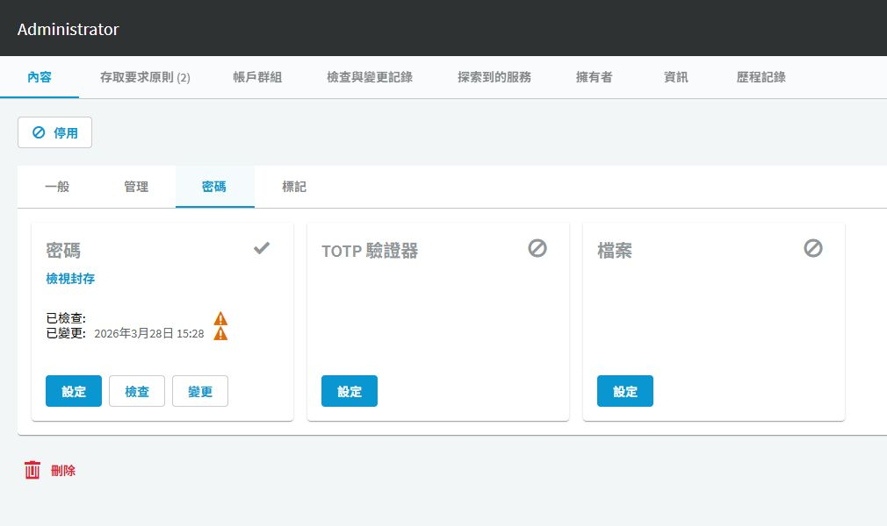

# SPP 資產帳戶密碼變更

## 目的

驗證 SPP 能將新密碼寫入目標帳戶並持續保持一致，再啟用排程輪替。

## 適用範圍

畫面與中文操作名稱於 2026-09-30 以 SPP 9.0.0.2807 Web 用戶端核對；文末 8.0 LTS 官方文件作為原理參考，不代表所有 9.0 行為均已驗證。 適用已完成服務帳戶設定的資產。

## 前置條件

Asset Administrator 已完成[服務帳戶設定](spp-service-account.md)與[密碼原則](spp-password-policy.md)。取得維護時段，確認 Windows 服務、排程、IIS 應用程式集區或應用程式是否使用該帳戶，記錄相依項目、負責人與復原途徑。

## 操作步驟

### 三個按鈕的差異

開啟 `資產管理 > 帳戶`，搜尋資產並開啟指定帳戶，進入 `內容 > 密碼`。

圖 1：實際密碼作業入口。已檢查／已變更旁有警告圖示，本圖不是成功輪替證明。

| 按鈕 | 用途 | 完成後要確認 |
|---|---|---|
| 設定 | 登錄保險箱應保存的已知密碼 | 不代表目標端密碼已被修改 |
| 檢查 | 驗證保管的密碼與目標端是否一致 | 該次檢查結果與時間，不只看「有密碼」勾號 |
| 變更 | 執行目標帳戶密碼輪替 | 變更結果、後續檢查、登入與相依服務皆通過 |

上方「檢查與變更記錄」用來核對此次工作，不以過去的日期代替本次結果。若畫面出現警告，先確認資產服務帳戶、連線與有效設定檔，再決定是否執行；不要連續按「變更」嘗試排錯。本次只有檢視，未執行任何密碼設定、檢查或輪替。

### 實施與驗收

1. 選擇單一測試帳戶，記錄資產、帳戶、有效 Password Profile、檢查結果及下一次排程時間。
2. 從帳戶的密碼操作執行 `Check Password`。檢查失敗時先處理憑證、網路或權限，不直接批次變更。
3. 執行 `Change Password`，等待該次工作完成，到帳戶上方「檢查與變更記錄」核對該次結果，必要時再查歷程記錄。
4. 再次執行 `Check Password`，並透過核准的工作階段登入，確認密碼與目標端一致。
5. 若有相依服務，確認其憑證更新與重啟結果，實測應用程式功能。只有登入成功仍不足以代表輪替驗收通過。
6. 在 `Asset Management > Profiles > View Password Profile Components > Change Password` 建立排程，將規則納入測試 Password Profile，再小範圍指派。
7. 等待一次排程實際執行成功，保留前後作業狀態及相依服務驗證紀錄，再擴大套用。

## 注意事項

Set Password 是登錄已知密碼，Check Password 是驗證，Change Password 才是變更作業；不要用重新填入舊密碼的方式「回復」已輪替的帳戶。

輪替失敗時先停止擴大套用，判斷目標是否已變更成功但後續同步失敗。依實際有效憑證重新對齊，必要時由目標管理者依變更程序重設；復原不是保證可還原原密碼。

## 相關文件

- [實機截圖與驗證範圍](environment-evidence.md)
- [官方：SPP 8.0 LTS，Change Password](https://support.oneidentity.com/technical-documents/one-identity-safeguard-for-privileged-passwords/8.0%20lts/administration-guide/80)
- [官方：帳戶密碼操作](https://support.oneidentity.com/technical-documents/one-identity-safeguard-for-privileged-passwords/8.0%20lts/administration-guide/79)
