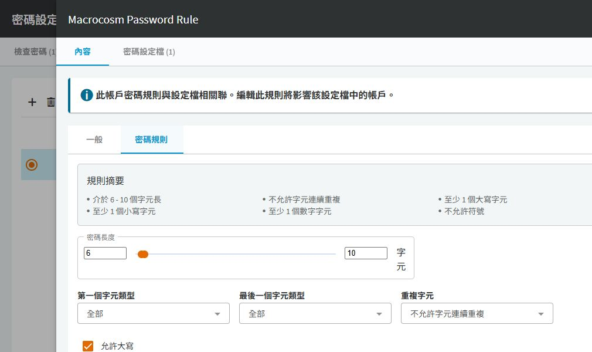

# SPP 密碼原則與設定檔

## 目的

分別管理密碼組成規則、檢查排程與變更排程，避免直接修改共用設定而影響所有帳戶。

## 適用範圍

畫面與中文操作名稱於 2026-09-30 以 SPP 9.0.0.2807 Web 用戶端核對；文末 8.0 LTS 官方文件作為原理參考，不代表所有 9.0 行為均已驗證。 本篇處理納管帳戶，不是平台使用者登入密碼原則。

## 前置條件

具備 Asset Administrator 或適當分割區權限。先盤點目標作業系統與應用程式允許的密碼長度、字元及密碼歷程限制。

## 操作步驟

> 截圖未涵蓋完整規則與排程；不要用局部畫面確認所有下方欄位。

### 密碼規則與設定檔的關係

實際入口是 `資產管理 > 設定檔 > 檢視密碼設定檔元件`。元件畫面分成「檢查密碼」、「變更密碼」、「帳戶密碼規則」與「密碼同步群組」。設定檔再將檢查排程、變更排程與密碼規則組合，指派給帳戶。

進入「帳戶密碼規則」，選取規則後按鉛筆，切到「密碼規則」。先閱讀上方「此帳戶密碼規則與設定檔相關聯」提示，再決定是否另建專用規則。

圖 1：既有 Macrocosm Password Rule 顯示 6–10 字元及不允許符號，僅記錄現況，不是建議的正式密碼強度。未儲存異動。

現場規則的長度、必要字元數與排除字元都要按目標限制重新設計。變更共用規則前，從「密碼設定檔」分頁追查引用關係，再從帳戶「管理」確認是否繼承。只改規則，不會證明目標已接受新的密碼。

本次「檢查密碼」元件的既有排程顯示「永不」。這是現況，不應將新增帳戶視為已安排定期檢查。

### 實施與驗收程序（尚未實跑）

1. 在 `資產管理 > 設定檔 > 檢視密碼設定檔元件 > 帳戶密碼規則` 新增專用規則，設定長度與必要字元類型，排除目標不接受的字元。
2. 在同一元件管理頁建立 Check Password 與 Change Password 設定。首次測試不要安排尚未核准的自動變更時段。
3. 到 `Asset Management > Profiles > Password Profiles` 建立 `Pilot-Password-Profile`，分別選取檢查、變更與帳戶密碼規則，儲存。
4. 僅將一個測試帳戶明確指派至該設定檔，確認有效設定沒有誤用到整台資產或整個分割區。
5. 完成一次手動變更、檢查、工作階段登入與相依服務驗證後，再啟用正式排程。
6. 記錄變更前後設定檔名稱、套用對象、時區與維護時段。若需撤回，恢復原設定檔指派；已變更的密碼不會隨之還原。

## 注意事項

官方規則的繼承順序為：帳戶明確指派優先，其次是資產設定檔，再其次是分割區預設。修改資產設定檔不會覆蓋帳戶明確指派的設定。

SPP 可產生的長度不代表目標能完整接收；部分平台可能截斷密碼。請用實際登入驗證，避免僅看變更工作成功。

## 相關文件

- [實機截圖與驗證範圍](environment-evidence.md)
- [官方：SPP 8.0 LTS，Account Password Rules](https://support.oneidentity.com/technical-documents/one-identity-safeguard-for-privileged-passwords/8.0%20lts/administration-guide/81)
- [官方：Password Profile 繼承](https://support.oneidentity.com/technical-documents/one-identity-safeguard-for-privileged-passwords/8.0%20lts/administration-guide/66)
- [官方：建立 Password Profile](https://support.oneidentity.com/technical-documents/one-identity-safeguard-for-privileged-passwords/8.0%20lts/administration-guide/79)
