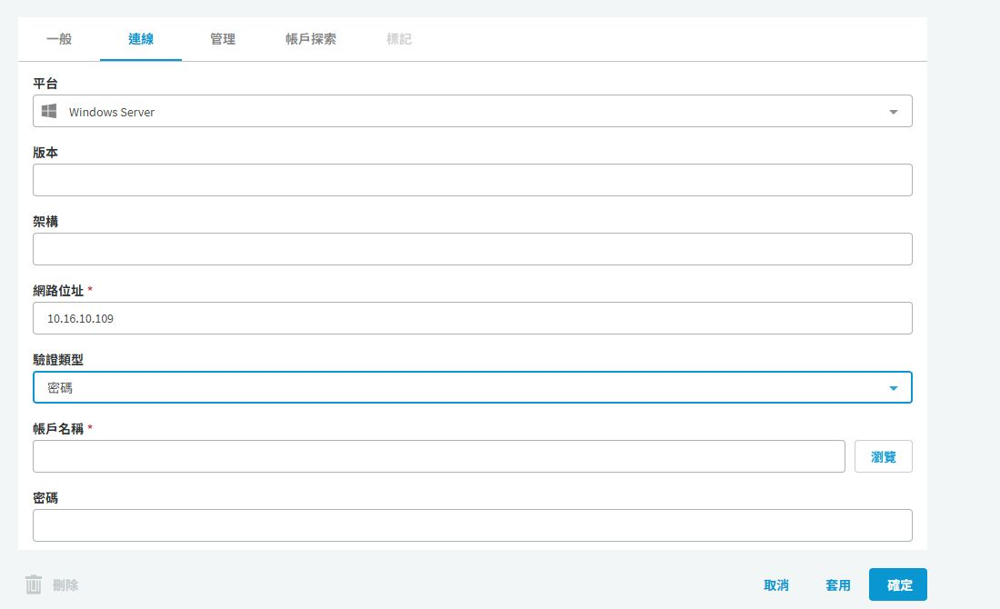

# SPP 資產服務帳戶設定

## 目的

指定 SPP 連到資產檢查、變更密碼時使用的驗證身分。本篇的服務帳戶是 SPP 的資產連線憑證，不等同於 Windows 服務的 Log On As 帳戶。

## 適用範圍

畫面與中文操作名稱於 2026-09-30 以 SPP 9.0.0.2807 Web 用戶端核對；文末 8.0 LTS 官方文件作為原理參考，不代表所有 9.0 行為均已驗證。 本次畫面僅核對 Windows Server；Windows 服務與排程相依性仍須另行盤點。

## 前置條件

具備 Asset Administrator 權限。目標端已建立專用管理帳戶，授權範圍符合所選平台的密碼管理需求；Linux 若使用 sudo 或 su，須先核對該平台支援的提權方式。請勿直接以整個網域的高權限帳戶作為共用服務帳戶。

## 操作步驟

> 圖中下拉欄位顯示的選項不代表已展示全部可用選項；畫面外的連接埠等欄位需另行核對。

### Windows 資產的實際設定位置

開啟 `資產管理 > 資產`，搜尋目標並開啟詳細資料，進入 `內容 > 連線`，按鉛筆圖示。核對「平台」與「網路位址」後，從「驗證類型」選擇適合的方式。本次 Windows Server 畫面提供「無」、「密碼」、「目錄帳戶」，不提供 SSH 金鑰；Linux 選項須依平台另查。

圖 1：將驗證類型切換為「密碼」後的空白欄位示範；未輸入憑證、未套用，已按「取消」恢復原設定。

「帳戶名稱」填 SPP 連入目標執行管理作業的專用帳戶；「密碼」填該帳戶目前有效的密碼。使用目錄帳戶時，改由「瀏覽」選擇已納管的身分。RDP 工作階段連接埠是工作階段連線設定，不是 Windows 密碼管理所需連接埠的完整清單。

本次檢視的 EX2016 原始驗證類型為「無」。因此可以用它說明欄位位置，不能拿來當成服務帳戶連線測試已通過的證據。

### 實施與驗收程序（尚未實跑）

1. 在 `Asset Management > Assets` 選取單一測試資產，開啟連線設定，記錄原本驗證類型與帳戶名稱，不記錄密碼。
2. 核對 Platform 與 Network Address。Windows Server 的「驗證類型」依需求選「密碼」或「目錄帳戶」；Linux 的 SSH Key 支援須依所選平台確認。
3. Password 填入專用 Service Account Name 與目前密碼；Directory Account 選擇已納管的目錄帳戶；SSH Key 使用已核准的金鑰與所需 passphrase。
4. Linux 資產的主機金鑰須透過主控台或可信管道核對，不能只接受網路首次取得的指紋。
5. 儲存並執行資產連線測試，再對一個非正式環境帳戶執行 Check Password。
6. 連線與檢查均成功後，才按[變更密碼程序](spp-password-change.md)測試一次輪替。

## 注意事項

SPP 官方說明：刪除服務帳戶會使資產驗證類型回到 None，停用該資產帳戶的自動密碼／SSH 金鑰管理。因此移除服務帳戶前，須確認替代憑證與輪替排程。

本專案建議保留一條經核准的緊急維運途徑。測試失敗時恢復原連線設定並核對目標端密碼，不連續觸發變更。

## 相關文件

- [實機截圖與驗證範圍](environment-evidence.md)
- [官方：SPP 8.0 LTS，資產驗證與服務帳戶](https://support.oneidentity.com/technical-documents/one-identity-safeguard-for-privileged-passwords/8.0%20lts/administration-guide/59)
- [新增資產](../../spp_asset.md)
