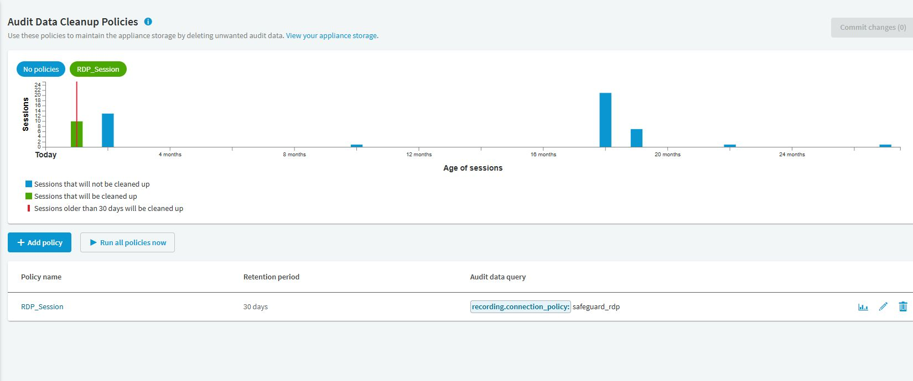

# SPS 稽核資料清理原則

## 目的

依核准的保存期限清除過期稽核資料，避免刪除尚須保存的證據。

## 適用範圍

畫面與操作名稱於 2026-09-30 以 SPS 9.0.0 Web 用戶端核對；文末 8.0 LTS 官方文件作為原理參考，不代表所有 9.0 行為均已驗證。 清理會刪除稽核資料；本次只檢視原則，不執行清理。

## 前置條件

資料擁有人已核准保存期限與排除範圍，完成[備份與封存回放驗證](sps-backup-archive.md)。涉及調查、訴訟或法遵保全的側錄須排除在清理範圍外。

## 操作步驟

### 先看預覽，再決定清理範圍

開啟 `Policies > Audit Data Cleanup Policies`。上方圖表依工作階段年齡顯示預計清理與保留的資料；下方清單列出原則、保留天數與查詢。

圖 1：現場 RDP_Session 保留 30 天，查詢為 recording.connection_policy: safeguard_rdp。未執行 Run all policies now。

每列右側「Preview policy」用於核對影響範圍，「Edit policy」編輯條件。修改後需再核對 Commit changes 的待提交數量；`Run all policies now` 會啟動清理，不是預覽按鈕。

現場 RDP 連線尚未指派 Backup policy／Archive policy，不能因有清理原則就認為已完成備份。必須先完成保存與回放驗收，再按已核准期限提交清理設定。

### 實施與驗收程序（尚未實跑）

1. 記錄原則名稱、適用連線原則、保存天數與應排除的工作階段。先用搜尋確認查詢的實際命中範圍並抽樣回放。
2. 到 `Policies > Audit Data Cleanup Policies` 選擇 `Add policy`。
3. 在 Policy name 輸入唯一名稱；Audit data older than 填核准的天數。8.0 LTS 參考文件允許 30–100,000 天；9.0 的有效限制須以表單驗證與該版文件核對，不為了測試而縮短正式保存期限。
4. Audit data query 限縮到已驗證的對象。若測試連線原則確實命名為 `ssh-pilot`，可使用 `protocol:SSH AND recording.connection_policy:ssh-pilot`；環境名稱不同時須重新查詢驗證，不能直接套用。
5. 再次核對天數與查詢後儲存。8.0 LTS 參考文件記載每日 22:01 清理；本次未驗證 9.0 排程，不直接以該時間承諾清理窗口。須核對裝置時間、當版說明及封存完成時間。
6. 清理後核對到期測試資料與未到期資料，確認刪除範圍符合預期，留存查詢、筆數與執行紀錄。

## 注意事項

本專案建議以清理期限大於封存期限並保留緩衝的方式安排，不只把兩項作業排在同一天。封存檔存在也不代表原搜尋索引、metadata 與回放鏈仍完整。

若發現條件錯誤，立即停用或移除新建清理原則以停止後續刪除；已刪資料須評估備份復原，不承諾可由介面取消復原。

## 相關文件

- [實機截圖與驗證範圍](environment-evidence.md)
- [官方：SPS 8.0 LTS，Configuring cleanup policies](https://support.oneidentity.com/technical-documents/one-identity-safeguard-for-privileged-sessions/8.0%20lts/administration-guide/28)
- [回專案目錄](../../README.md)
