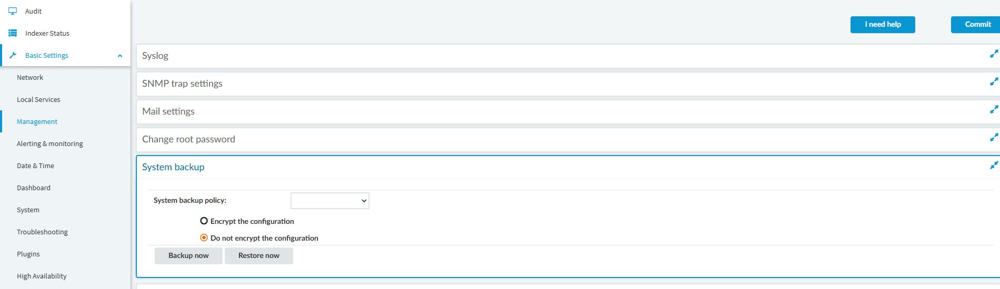
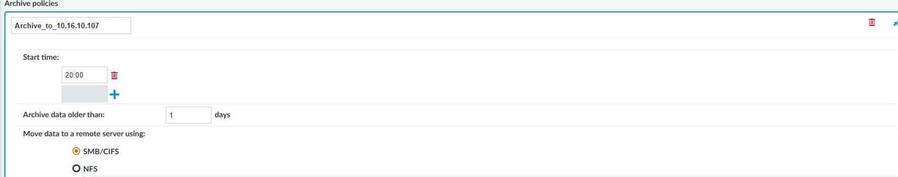

# SPS 備份與封存原則

## 目的

分別保存系統組態、連線資料及側錄，並在可回放的前提下釋放裝置空間。

## 適用範圍

畫面與操作名稱於 2026-09-30 以 SPS 9.0.0 Web 用戶端核對；文末 8.0 LTS 官方文件作為原理參考，不代表所有 9.0 行為均已驗證。 Backup 建立副本；Archive 依設定搬移到外部保存，兩者須分別驗證。

## 前置條件

已核准保存期限，準備可用的 SMB／NFS／Rsync over SSH 目的地及權限。每個用途與節點使用專用目錄，先建立共用與所需子目錄。備份目標不可混放其他檔案，官方警告備份可能刪除目標目錄內其他資料。

## 操作步驟

### 三個設定位置必須串起來

`Policies > Backup & Archive` 定義目的地與排程；`Basic Settings > Management > System backup` 指派系統組態備份；`Traffic Controls > RDP／SSH > Connections` 指派各連線的備份與封存。

圖 1：System backup policy 空白，且選 Do not encrypt the configuration。這是現況待調整，不是建議設定。

目前有一筆封存原則，畫面顯示 20:00 執行、資料超過 1 天才封存，使用 SMB/CIFS。這些值只記錄實機現況，正式期限須依保存需求決定。

圖 2：既有封存原則的上半部；登入憑證與目的地詳細路徑不放入截圖。

圖 3：safeguard_rdp 的 Backup policy 與 Archive policy 仍空白。建立原則不等於已套用，也不能宣稱側錄已受保護。

在核准的連線原則分別選取 Backup policy／Archive policy 後按 Commit，再驗證實際工作、目的地檔案及回放。檢查系統組態與連線側錄兩條保存路徑，不能只做其中之一。本次沒有 Commit、沒有 Backup／Archive／Restore 作業，也未讀取備份內容。

### 實施與驗收程序（尚未實跑）

1. 在 `Policies > Backup & Archive > Backup policies` 建立系統備份原則，設定目的地、驗證與排程。
2. 到 `Basic Settings > Management > System backup` 指派該原則並啟用 Encrypt configuration，依官方程序使用 GPG 保護組態；私密金鑰離機保存。
3. 另外建立連線資料備份原則，在各協定 `Connections` 的 Backup policy 指派並儲存。系統備份不包含 audit trail，不能省略此步。
4. 執行測試備份，確認目標檔案及工作結果。隔離演練需先還原相符的系統組態與 metadata，再還原連線資料。
5. 在 Archive policies 建立封存原則，選定移至遠端伺服器的方式、目的地、排程與本機保存天數；本例不使用直接刪除資料的選項。
6. 將封存原則套至單一測試連線原則。叢集使用節點區隔目錄，保留適當的 Cluster Node ID 路徑設定。
7. 待一筆到期的測試側錄完成封存後，從搜尋結果回放，驗證遠端存取及解密均成功，再擴大套用。

## 注意事項

組態加密不代表整份備份中所有資料均加密，儲存端仍須限制存取。曾用於封存資料的 Archive Policy 不可任意刪除，以免失去對既有側錄的存取關係。

本專案建議讓清理期限長於封存門檻並保留失敗補跑緩衝。若封存或回放失敗，停止擴大套用並暫停相關清理，保留來源及原則供排查。

## 相關文件

- [實機截圖與驗證範圍](environment-evidence.md)
- [官方：SPS 8.0 LTS，系統備份](https://support.oneidentity.com/it-it/technical-documents/one-identity-safeguard-for-privileged-sessions/8.0%20lts/administration-guide/8)
- [官方：資料與組態備份及目標目錄警告](https://support.oneidentity.com/ja-jp/technical-documents/one-identity-safeguard-for-privileged-sessions/8.0%20lts/administration-guide/25)
- [官方：封存、資料備份與加密](https://support.oneidentity.com/technical-documents/one-identity-safeguard-for-privileged-sessions/8.0%20lts/administration-guide/basic-settings/archiving)
- [稽核資料清理](sps-audit-cleanup.md)
