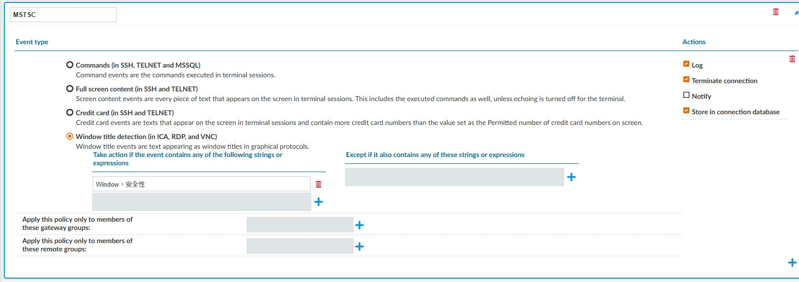
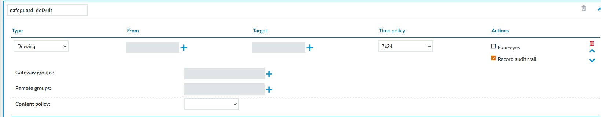

# SPS 即時內容原則

## 目的

在支援的工作階段中偵測指定文字或命令，依規則記錄事件、通知或中止連線。

## 適用範圍

畫面與操作名稱於 2026-09-30 以 SPS 9.0.0 Web 用戶端核對；文末 8.0 LTS 官方文件作為原理參考，不代表所有 9.0 行為均已驗證。 本次核對 RDP 視窗標題與通道關聯；以下 SSH 測試程序尚未實跑。

## 前置條件

已建立專用測試 Connection Policy 與 Channel Policy，並確認通知目的地。避免直接編輯由多條正式連線共用的通道原則。

## 操作步驟

### 事件、比對條件與動作分開設定

開啟 `Policies > Content Policies`，展開原則。Event type 區分 Commands、Full screen content、Credit card 與 Window title detection；Actions 區分 Log、Terminate connection、Notify、Store in connection database。

圖 1：既有 MSTSC 原則，選擇視窗標題偵測與中止連線；含中文比對字串，尚未證明偵測有效，不是推薦範本。

比對欄位每列是一個字串或表示式。不要把 同一列中的 Window 與安全性 當成兩筆獨立條件：本次只看到同一列文字。中文即時監控的支援限制應另查當版文件，不能以 OCR 可辨識繁體中文推論即時阻擋也支援。

再到 `Traffic Controls > RDP > Channel Policies`，開啟 Connection 使用的通道原則，在 Drawing 項目查看 Content policy。

圖 2：safeguard_default 的 Drawing 已勾選 Record audit trail，但 Content policy 空白。側錄已開啟不代表內容偵測已生效。

先在專用測試通道選取測試 Content policy，確認 Connection 引用該 Channel policy，再提交與測試。本次未指派、未中止任何工作階段；既有 MSTSC 原則不能作為阻擋驗收證據。

### 實施與驗收程序（尚未實跑）

1. 到 `Policies > Content Policies` 新增 `Pilot-Content-Alert`。
2. SSH 測試選擇 Full screen content，Match 輸入 `PAM_CONTENT_TEST`。有排除需求時再設定 Ignore，避免寬鬆的排除式抵銷偵測。
3. 第一輪只啟用記錄事件及必要通知，先不啟用中止連線；儲存原則。
4. 在測試 Channel Policy 選取這個 Content Policy，確認測試 Connection Policy 引用該 Channel Policy，提交變更。
5. 先建立不含測試字串的獨立 SSH 工作階段做負向測試，確認未誤報，再開另一個新工作階段執行 `printf '%s\n' 'PAM_CONTENT_TEST'`，核對事件與通知。Full screen content 也可能比對輸入的命令本身，這僅驗證畫面文字偵測，不證明命令執行語意；不要在仍留有測試字串的畫面驗證負向案例。
6. 若需求是阻擋，在隔離測試原則啟用中止連線並重測。正式導入前，由應用負責人確認誤判影響與連線中止後的交易處理。

## 注意事項

8.0 LTS 官方參考文件明示圖形協定即時內容監控不支援 Arabic 與 CJK；本次未取得可讀的 9.0 對應章節，因此不能承諾繁體中文視窗標題可即時阻擋。辨識採啟發式方法，可能漏判；效能影響須用實際工作階段測試。

本專案建議先告警再阻擋，並搭配目標系統權限控管。撤回時恢復原 Channel Policy 對應，再用新工作階段驗證。

## 相關文件

- [實機截圖與驗證範圍](environment-evidence.md)
- [官方：SPS 8.0 LTS，Content Policies 與限制](https://support.oneidentity.com/technical-documents/one-identity-safeguard-for-privileged-sessions/8.0%20lts/administration-guide/58)
- [事後 OCR 索引](sps-ocr.md)
