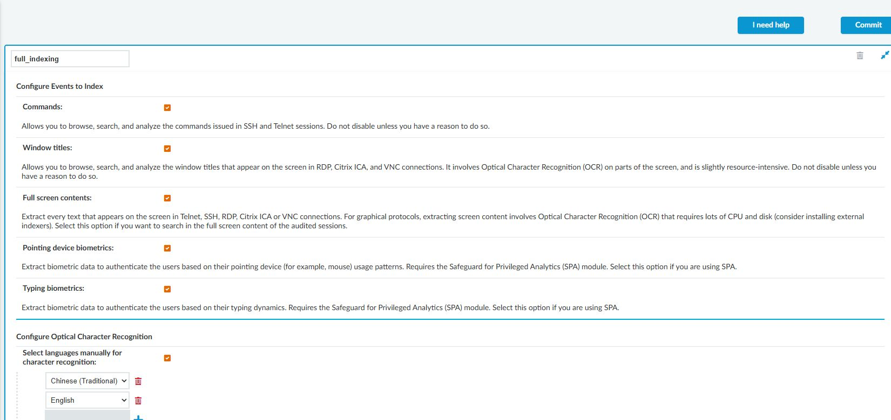
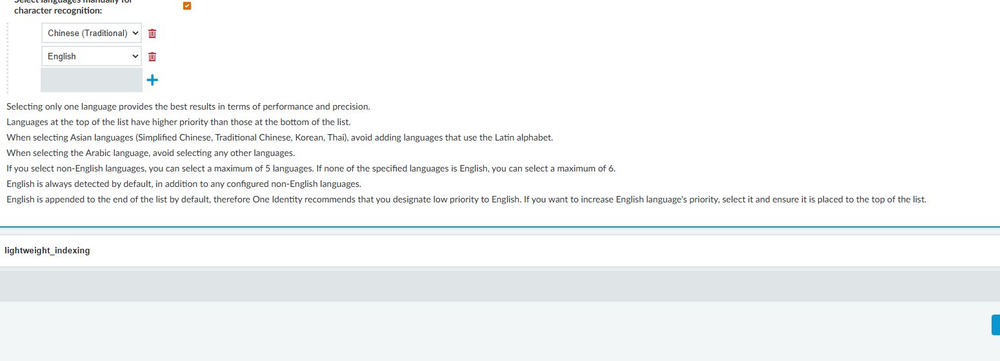
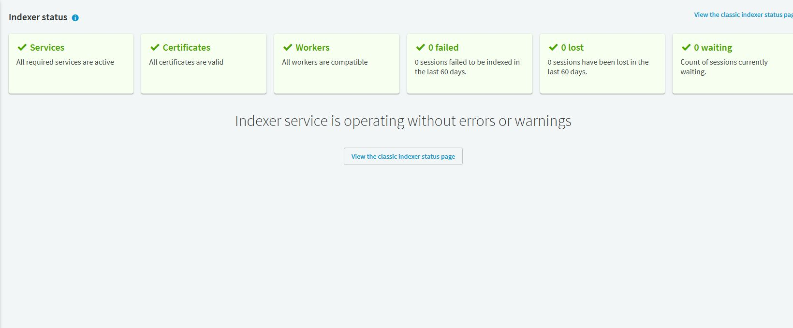

# SPS OCR 設定與套用

## 目的

將圖形工作階段的畫面文字建立索引，供事後搜尋與定位側錄。

## 適用範圍

畫面與操作名稱於 2026-09-30 以 SPS 9.0.0 Web 用戶端核對；文末 8.0 LTS 官方文件作為原理參考，不代表所有 9.0 行為均已驗證。 OCR 是事後索引，不等同即時內容阻擋。

## 前置條件

具有 Indexer Policies 與目標連線原則設定權限；側錄已正常產生。加密側錄須具備索引所需的解密金鑰並依內部規範保管。

## 操作步驟

> RDP 指派截圖未包含完整原則名稱；文中 safeguard_rdp 名稱來自當時頁面檢視，不是裁切圖本身可辨識的欄位。

### 索引原則、語言與連線指派

到 `Policies > Indexer Policies`，展開 `full_indexing`。畫面將 Commands、Window titles 與 Full screen contents 分開；要搜尋 RDP 畫面內文，須核對 Full screen contents，而不只 Window titles。

圖 1：既有 full_indexing 原則。SPA 生物行為分析選項須按實際需求與授權設定，不能因本圖勾選就全部沿用。

「Configure Optical Character Recognition」下的「Select languages manually for character recognition」控制語言清單。本次已有 Chinese (Traditional) 與 English；畫面說明建議亞洲語言避免另加拉丁字母語言，且英文預設會辨識。應以專用測試原則調整並比較，不直接更動共用原則。

圖 2：現況同時選了繁體中文與英文；下方內建說明是調整與驗收的依據，不是已完成調校的結果。

到 `Traffic Controls > RDP > Connections`，展開目標連線，向下找 Enable indexing 與 Indexing policy。本次 `safeguard_rdp` 已勾選，指派 `full_indexing`，Priority 為 normal。

圖 3：索引已指派；Backup policy 與 Archive policy 空白是另一項待處理事項。

從左側 `Indexer Status` 檢查服務與佇列，再進行唯一測試字串搜尋。

圖 4：本次檢視服務正常，近 60 天 failed／lost 為 0，waiting 為 0。狀態正常不等於繁體中文字串辨識率已驗收。

### 實施與驗收程序（尚未實跑）

1. 到 `Basic Settings > Local Services > Indexer service` 確認索引服務啟用，依 CPU、記憶體與現有佇列設定平行處理量，儲存。
2. 到 `Policies > Indexer Policies` 建立測試原則。要搜尋畫面內文時啟用 Full screen contents；lightweight_indexing 僅提供較精簡的命令／視窗標題索引，不足以取代完整畫面索引。
3. 已知語言時勾選 Select languages manually for character recognition。繁體中文情境選 Chinese (Traditional)，依官方建議避免再混選拉丁字母語言。
4. 先以少量側錄比較索引時間與辨識率；本次 9.0 原則畫面未見獨立的「辨識精度」欄位，不要求填寫不存在的欄位。
5. 到 `Traffic Controls > RDP > Connections`（其他協定依各自頁面） 選取測試連線原則，在 Enable indexing 選擇新 Indexing Policy，儲存。
6. 建立新 RDP 工作階段，在畫面輸入無敏感資料的唯一識別字串，例如 `PAM-OCR-TEST-20260930`，結束後等待索引完成，再搜尋並核對畫面時間點。
7. 使用繁體中文測試文字重複驗證，記錄索引延遲與漏字情況；歷史側錄不因改原則就保證自動重新索引。

## 注意事項

OCR 受字型、畫面品質與語言影響，不保證逐字正確。完整畫面索引會增加負載；本專案建議保留原 Indexing Policy，若佇列持續增加，先將測試連線恢復原原則並調整容量。

## 相關文件

- [實機截圖與驗證範圍](environment-evidence.md)
- [官方：SPS 8.0 LTS，內建索引與套用](https://support.oneidentity.com/de-de/technical-documents/one-identity-safeguard-for-privileged-sessions/8.0%20lts/administration-guide/82)
- [官方：OCR 語言限制](https://support.oneidentity.com/technical-documents/one-identity-safeguard-for-privileged-sessions/8.0%20lts/rest-api-reference-guide/47)
- [即時內容原則](sps-content-policy.md)
